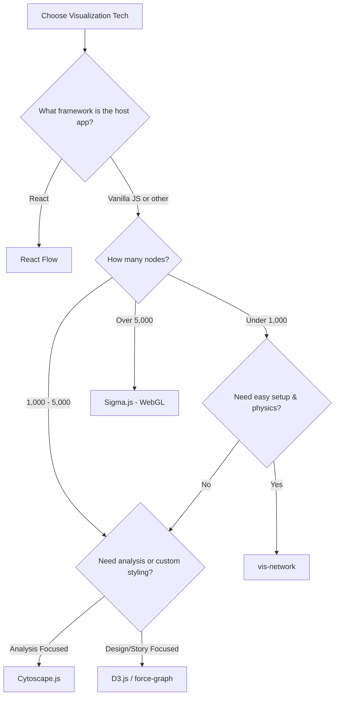

# Appendix: Graph Visualization Libraries

Choosing the optimal frontend library to render network diagrams is a foundational decision when designing interactive learning graphs and intelligent textbooks. While this curriculum relies primarily on `vis-network` for its immediate ease of use and interactive physics, distinct design requirements—such as extremely large-scale data, highly custom React interfaces, or formal graph analysis—warrant alternative choices.

!!! mascot-welcome "Comparing Graph Visualization Libraries"
    { class="mascot-admonition-img" }
    Welcome, curriculum architects! Let's connect the concepts! Bringing our learning graphs to life requires selecting a library that aligns with our technical stack and scaling goals. Let's explore the leading JavaScript libraries to determine the best fit for your projects.

---

## Library Comparison Matrix

The interactive directory below summarizes the key architectural traits and performance envelopes of the leading graph visualization libraries. You can search, filter, and sort the data dynamically.

<iframe src="../sims/graph-js-library-comparison/main.html" height="532px" width="100%" scrolling="no"></iframe>

[Run the Graph JS Library Comparison MicroSim Fullscreen](sims/graph-js-library-comparison/main.html){ .md-button .md-button--primary }

---

## Library Deep Dives & Code Templates

### 1. vis-network (vis.js)
`vis-network` is a specialized, component-driven library for rendering interactive networks. It features a robust, real-time physics engine that executes force-directed simulations directly in the browser out of the box.

*   **Key Strengths:** Minimal configuration needed for full interactivity (drag, pan, zoom, hover); built-in clustering; highly customizable node shapes and labels.
*   **Weaknesses:** Relies on an older, imperative codebase. Performance degrades beyond ~1,000 nodes due to synchronous single-threaded physics calculation.
*   **Minimal Setup:**
    ```html
    <div id="network" style="width: 600px; height: 400px; border: 1px solid lightgray;"></div>
    <script type="text/javascript" src="https://unpkg.com/vis-network/standalone/umd/vis-network.min.js"></script>
    <script type="text/javascript">
      const container = document.getElementById("network");
      const data = {
        nodes: new vis.DataSet([{ id: 1, label: "Concept A" }, { id: 2, label: "Concept B" }]),
        edges: new vis.DataSet([{ from: 1, to: 2, label: "prerequisite" }])
      };
      const options = { physics: { solver: "barnesHut", stabilization: true } };
      const network = new vis.Network(container, data, options);
    </script>
    ```

### 2. D3.js (Data-Driven Documents)
D3 is not a specialized graph-drawing tool, but rather a utility suite for binding data to the DOM (SVG or Canvas). The `d3-force` module calculates physical node coordinates, leaving actual rendering completely in the hands of the developer.

*   **Key Strengths:** Absolute creative freedom. Developers can animate nodes, construct complex SVG components, and build custom multi-stage transitions.
*   **Weaknesses:** Extremely steep learning curve. No default UI controls (panning, zooming, hover tooltip behavior must be written manually).
*   **Minimal Setup:**
    ```html
    <svg id="canvas" width="600" height="400"></svg>
    <script src="https://d3js.org/d3.v7.min.js"></script>
    <script>
      const nodes = [{ id: "A" }, { id: "B" }];
      const links = [{ source: "A", target: "B" }];
      const svg = d3.select("#canvas");
      
      const simulation = d3.forceSimulation(nodes)
        .force("link", d3.forceLink(links).id(d => d.id).distance(100))
        .force("charge", d3.forceManyBody().strength(-200))
        .force("center", d3.forceCenter(300, 200));

      const link = svg.append("g").selectAll("line").data(links).enter().append("line").attr("stroke", "#999");
      const node = svg.append("g").selectAll("circle").data(nodes).enter().append("circle").attr("r", 15).attr("fill", "orange");

      simulation.on("tick", () => {
        link.attr("x1", d => d.source.x).attr("y1", d => d.source.y).attr("x2", d => d.target.x).attr("y2", d => d.target.y);
        node.attr("cx", d => d.x).attr("cy", d => d.y);
      });
    </script>
    ```

### 3. React Flow (xyflow)
React Flow is a modern React component library designed specifically for building node-based applications, workflow builders, and customizable visual graphs.

*   **Key Strengths:** Every node is a React component. It is trivial to embed input elements, form fields, drop-down menus, and rich interactive layouts within a node. It provides seamless React integration and out-of-the-box controls.
*   **Weaknesses:** Because it renders nodes as regular HTML DOM elements (and only connections as SVGs), performance scales poorly beyond a few hundred visible nodes.
*   **Minimal Setup:**
    ```jsx
    import React from 'react';
    import ReactFlow, { Background, Controls } from 'reactflow';
    import 'reactflow/dist/style.css';

    const initialNodes = [
      { id: '1', position: { x: 100, y: 100 }, data: { label: 'Concept A' } },
      { id: '2', position: { x: 100, y: 250 }, data: { label: 'Concept B' } },
    ];
    const initialEdges = [{ id: 'e1-2', source: '1', target: '2', label: 'prerequisite' }];

    export default function FlowDiagram() {
      return (
        <div style={{ width: '600px', height: '400px', border: '1px solid #ccc' }}>
          <ReactFlow nodes={initialNodes} edges={initialEdges} fitView>
            <Background color="#ccc" gap={16} />
            <Controls />
          </ReactFlow>
        </div>
      );
    }
    ```

### 4. Cytoscape.js
Cytoscape.js is a professional-grade graph theory library. It includes deep graph-theoretic analysis utilities (e.g., shortest path computations, PageRank, A*, centrality calculations) coupled with a Canvas-based visualization layer.

*   **Key Strengths:** Powerful graph analysis API; highly structured layout mechanisms; designed to handle complex relational networks.
*   **Weaknesses:** Stylistic configurations rely on a custom, CSS-like JSON stylesheet wrapper that can feel rigid to design and customize.
*   **Minimal Setup:**
    ```html
    <div id="cy" style="width: 600px; height: 400px; border: 1px solid #ccc;"></div>
    <script src="https://cdnjs.cloudflare.com/ajax/libs/cytoscape/3.26.0/cytoscape.min.js"></script>
    <script>
      const cy = cytoscape({
        container: document.getElementById('cy'),
        elements: [
          { data: { id: 'a', label: 'Concept A' } },
          { data: { id: 'b', label: 'Concept B' } },
          { data: { id: 'ab', source: 'a', target: 'b' } }
        ],
        style: [
          { selector: 'node', style: { 'background-color': '#ff9800', 'label': 'data(label)' } },
          { selector: 'edge', style: { 'width': 3, 'line-color': '#ccc', 'target-arrow-shape': 'triangle' } }
        ],
        layout: { name: 'grid', rows: 2 }
      });
    </script>
    ```

### 5. Sigma.js
Sigma.js is built from the ground up to render large-scale graphs. It delegates rendering to WebGL, allowing fluid, high-frame-rate interaction with graphs containing tens of thousands of elements.

*   **Key Strengths:** Unmatched rendering performance. Smooth panning and zooming at massive scales. Uses standard `graphology` data structures.
*   **Weaknesses:** Features are bare-bones. Styling nodes requires writing custom WebGL shader logic. No built-in force-layout calculations; layout coordinates must be pre-calculated or computed asynchronously.
*   **Minimal Setup:**
    ```html
    <div id="container" style="width: 600px; height: 400px;"></div>
    <script src="https://cdnjs.cloudflare.com/ajax/libs/graphology/0.25.1/graphology.js"></script>
    <script src="https://cdn.jsdelivr.net/npm/sigma@2.4.0/build/sigma.min.js"></script>
    <script>
      const graph = new graphology.Graph();
      graph.addNode("a", { x: 0, y: 1, size: 15, label: "Concept A", color: "#ff9800" });
      graph.addNode("b", { x: 1, y: 0, size: 15, label: "Concept B", color: "#2196f3" });
      graph.addEdge("a", "b");

      const renderer = new Sigma(graph, document.getElementById("container"));
    </script>
    ```

### 6. force-graph (vasturiano)
`force-graph` provides a highly optimized, easy-to-use Canvas-based (or WebGL/Three.js-based for 3D) wrapper for force-directed diagrams.

*   **Key Strengths:** Fast startup; extremely fluid 2D and 3D capability using simple configuration APIs; performance-tuned Canvas loop.
*   **Weaknesses:** Customizing node rendering beyond circles/labels requires executing raw HTML5 Canvas 2D context drawing commands inside callback hooks.
*   **Minimal Setup:**
    ```html
    <div id="graph" style="width: 600px; height: 400px;"></div>
    <script src="https://unpkg.com/force-graph"></script>
    <script>
      const data = {
        nodes: [{ id: "A", name: "Concept A" }, { id: "B", name: "Concept B" }],
        links: [{ source: "A", target: "B" }]
      };
      const Graph = ForceGraph()(document.getElementById('graph'))
        .graphData(data)
        .nodeLabel('name')
        .nodeColor(() => '#ff9800');
    </script>
    ```

### 7. G6 (AntV)
G6 is a high-level graph visualization engine developed by Alibaba's AntV team, providing a rich suite of built-in layout algorithms (e.g., radial, concentric, force, grid) and interactive components.

*   **Key Strengths:** Excellent out-of-the-box layout variety; enterprise-ready graph editors and analysis tools.
*   **Weaknesses:** Large bundle size. Some advanced documentation and community help remain primary in Chinese.
*   **Minimal Setup:**
    ```html
    <div id="mountNode" style="width: 600px; height: 400px; border: 1px solid #ccc;"></div>
    <script src="https://gw.alipayobjects.com/os/lib/antv/g6/4.8.24/dist/g6.min.js"></script>
    <script>
      const graph = new G6.Graph({
        container: 'mountNode',
        width: 600,
        height: 400,
        modes: { default: ['drag-canvas', 'zoom-canvas', 'drag-node'] },
        defaultNode: { size: 30, style: { fill: '#ff9800', stroke: '#e65100' } }
      });
      graph.data({
        nodes: [{ id: 'node1', label: 'Concept A' }, { id: 'node2', label: 'Concept B' }],
        edges: [{ source: 'node1', target: 'node2' }]
      });
      graph.render();
    </script>
    ```

### 8. GoJS
GoJS is an enterprise-oriented, feature-rich commercial diagramming library. It is designed to construct interactive flowcharts, organization charts, industrial process diagrams, and complex taxonomies.

*   **Key Strengths:** Deep layout engine; professional, robust templates for flowcharts and swimlanes; high industrial reliability.
*   **Weaknesses:** Proprietary license. A watermark is displayed unless a commercial license is purchased. Imperative API style can feel verbose.
*   **Minimal Setup:**
    ```html
    <div id="myDiagramDiv" style="width:600px; height:400px; border: 1px solid #ccc;"></div>
    <script src="https://unpkg.com/gojs/release/go.js"></script>
    <script>
      const $ = go.GraphObject.make;
      const myDiagram = $(go.Diagram, "myDiagramDiv");

      myDiagram.nodeTemplate =
        $(go.Node, "Auto",
          $(go.Shape, "RoundedRectangle", { fill: "#ff9800", stroke: "#e65100" }),
          $(go.TextBlock, { margin: 8, stroke: "white" }, new go.Binding("text", "key"))
        );

      myDiagram.model = new go.GraphLinksModel(
        [{ key: "Concept A" }, { key: "Concept B" }],
        [{ from: "Concept A", to: "Concept B" }]
      );
    </script>
    ```

---

## Architectural Decision Framework

When selecting a library, use the diagnostics below to match your project's scaling and architectural needs.



### Quick Reference Selector

*   **Choose `vis-network` if:** You need an interactive graph component working within hours on a plain HTML/Markdown page, with automatic physics stabilization and intuitive panning/zooming.
*   **Choose `React Flow` if:** You are building an application with a React codebase where the graphs represent tools, workflow editors, or concept maps containing nested forms, input fields, or custom CSS components.
*   **Choose `D3.js` if:** Your project is an interactive editorial feature or custom visualization where you need unique visual transitions, custom shape transformations, and absolute styling control.
*   **Choose `Cytoscape.js` if:** Your app performs mathematical graph operations (e.g., executing Dijkstra's algorithm for finding the shortest prerequisite pathway) in addition to displaying the network.
*   **Choose `Sigma.js` if:** Your graph represents a massive knowledge base (e.g., mapping a university's entire catalog of 20,000 course concepts) and browser-based rendering frames must remain fluid.

!!! mascot-tip "The Standard Path"
    { class="mascot-admonition-img" }
    For most educational technologists building textbooks in the MkDocs ecosystem, **vis-network** is the perfect baseline. It integrates easily into static pages, needs no bundler, and automatically stabilizes nodes without complex math. However, if your book relies on a custom React dashboard, **React Flow** should be your primary choice!
