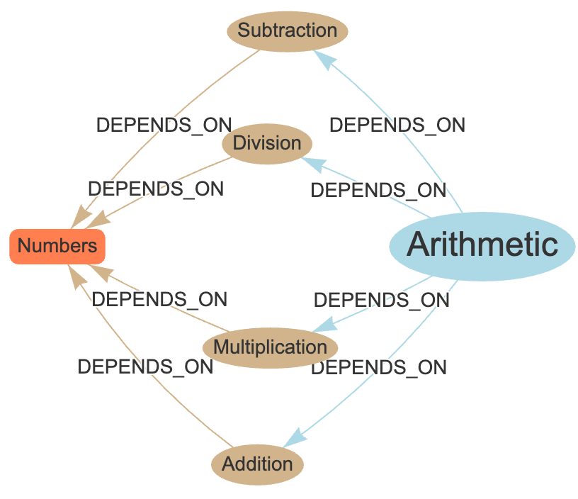

# Learning Graphs

In this chapter, we introduce you to the foundational data structures that are used
by intelligent agents that build customized lesson plans for each student: The Learning Graph.

## What Are Learning Graphs?

Learning graphs are network graph that stores learning [Concepts](../glossary.md#concept) and their dependencies.

Learning graphs are a type of [Directed Graphs](../glossary.md#directed-graph) where every node is a learning Concept
and every edge is a concept dependency or prerequisite.

A **Learning Graph** is a powerful representation of knowledge used to model the relationships between different learning concepts and their dependencies. This graph-based approach enables a structured, visual way to map out the sequence in which learners need to acquire knowledge, making it particularly effective for hypercustomized lesson plan generation.

In essence, a learning graph is a type of directed graph where every node represents a learning concept, and each directed edge signifies a prerequisite relationship between two concepts. By modeling the learning process as a graph, we can identify the optimal path a learner should follow to master a specific topic.

### Why Learning Graphs Matter

Learning graphs offer several key advantages when designing personalized learning paths:

-   **Clarity in Concept Dependencies**: They make the relationships between concepts explicit, ensuring learners acquire foundational knowledge before advancing to more complex topics.
-   **Adaptive Learning Paths**: By analyzing the structure of the graph, we can create tailored lesson plans for individual learners, focusing on the gaps in their knowledge while skipping over concepts they've already mastered.
-   **Flexibility and Scalability**: Learning graphs are highly flexible and can scale across different subjects and educational levels, from elementary school topics to advanced technical subjects.

### Structure of a Learning Graph

A learning graph is composed of two primary elements:

-   **Nodes (Concepts)**: Each node represents a distinct learning concept. These could range from fundamental principles, like "Ohm's Law" in an electrical circuits course, to more complex topics like "Neural Networks" in a machine learning course.
-   **Edges (Prerequisites)**: Each directed edge represents a dependency or prerequisite. For example, a concept such as "Electric Current" must be understood before a learner can grasp "Circuit Resistance."

<caption>
A diagram showing 5-6 nodes connected by directed edges, illustrating a simple learning path where each node depends on the previous one. For instance, concepts related to mathematics, starting with "Basic Algebra" leading to "Linear Equations" and ending with "Quadratic Functions."
</caption>

## Types of Learning Graphs

Learning graphs can take on various forms depending on the complexity of the learning domain and the learner's background.

### Linear Graph**:

In this form, each concept has exactly one prerequisite. This structure is suitable for topics that build incrementally without divergence, such as learning how to assemble a robot where part order is critical.
In this lesson, each step depends on the prior step being completed before it can begin.

1. Open Box
2. Confirm Part List
3. Attach Motor Chassis
4. Attach Wheels to Chassis
5. Attach Battery to Chassis
6. Mount Microcontroller
7. Mount Sensors
8. Connect Microcontroller
9. Upload Code to Microcontroller
10. Test the Robot

### Branching Graph

A more complex form where certain concepts can lead to multiple others. For example, mastering "Statistics" may be a prerequisite for both "Data Science" and "Machine Learning."

Example:

1. Learn Python
2. Use 

-   **Converging Graph**: This graph structure occurs when multiple prerequisite concepts lead to the mastery of a single, more advanced concept. For instance, mastering both "Trigonometry" and "Algebra" may be required before understanding "Calculus."

#### Figure Suggestion:

2.  **Branching Graph Example**: A diagram showing nodes with multiple paths branching out from a single node, illustrating how different branches of learning lead to diverse advanced topics.

### Practical Applications of Learning Graphs

1.  **Course Design and Planning**: Educators can use learning graphs to map out entire courses, ensuring the logical progression of topics and making it easy to identify areas where students might struggle based on their gaps in prerequisite knowledge.

2.  **Personalized Learning Paths**: In personalized education, learning graphs allow for dynamic adjustment of lesson plans based on an individual's current knowledge. When a learner demonstrates proficiency in a specific concept, they can immediately proceed to the next dependent concept.

3.  **Assessment and Remediation**: Learning graphs are particularly useful in assessment-driven learning environments. By pinpointing exactly where a student is struggling, educators can focus on reinforcing specific concepts without re-teaching the entire curriculum.

### Leveraging Learning Graphs in Hypercustomized Lesson Plans

When creating hypercustomized lesson plans, learning graphs provide the foundational structure to ensure that each student receives the exact lessons they need, in the proper sequence. By identifying where a learner is within the graph, lesson plans can be dynamically generated to either:

-   Focus on filling gaps in prerequisite knowledge
-   Accelerate the learner through concepts they have already mastered
-   Present appropriate challenges based on the learner's current level

This approach not only enhances learning efficiency but also keeps students engaged by delivering content that is neither too difficult nor too easy.

#### Figure Suggestion:

3.  **Customized Learning Path**: A learning graph with certain nodes highlighted, showing how an individualized lesson path is formed by skipping over mastered concepts and focusing on specific prerequisites.

### Challenges in Designing Learning Graphs

While learning graphs offer great benefits, there are some challenges in creating and maintaining them:

-   **Conceptual Granularity**: Deciding the appropriate level of granularity for concepts can be difficult. Too many fine-grained concepts may overcomplicate the graph, while too few might overlook essential nuances in learning.

-   **Dynamic Changes**: As educational methods and content evolve, learning graphs need to be adaptable to accommodate new concepts or altered dependencies.

### Conclusion

Learning graphs are an essential tool for structuring educational content and designing hypercustomized lesson plans. By representing concepts and their dependencies as a directed graph, educators can ensure that learners progress through material in an optimal, personalized manner. In the next chapter, we will delve deeper into what constitutes a "Concept" and how it plays a role in the overall structure of a learning graph.

#### Figure Suggestion:

4.  **Advanced Learning Graph**: A more detailed network graph with multiple branching paths and dependencies, showing how a complex subject area might be organized in a learning graph format.

4o

window.\_\_oai\_logHTML?window.\_\_oai\_logHTML():window.\_\_oai\_SSR\_HTML=window.\_\_oai\_SSR\_HTML||Date.now();requestAnimationFrame((function(){window.\_\_oai\_logTTI?window.\_\_oai\_logTTI():window.\_\_oai\_SSR\_TTI=window.\_\_oai\_SSR\_TTI||Date.now()}))