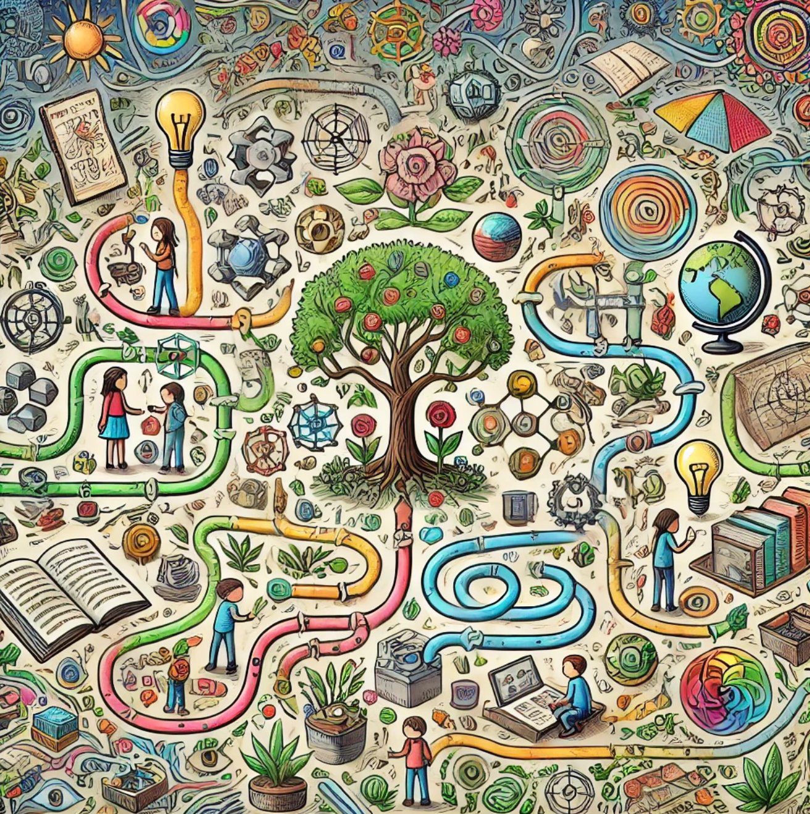

## Rhizomatic Learning

**Rhizomatic learning** is an educational model inspired by the way rhizome root systems grow and spread, allowing for non-linear, interconnected, and expansive pathways of knowledge acquisition.

Unlike most root systems with a single center tap root, rhizome root systems spread as a network in random directions.

This approach contrasts with traditional hierarchical or linear models, focusing instead on exploration, connection, and adaptability. Here's how Rhizombic learning might look in practice:

### Key Features of Rhizomatic Learning

#### Non-Linear Paths

-   Students can pursue various topics or skills in any order, much like how rhizomes grow in unpredictable directions. This encourages learners to follow their curiosity and discover connections organically.
-   Learning is seen as a web rather than a line, where each node (topic or skill) can connect to multiple others in diverse ways.

#### Interconnected Knowledge

- Rhizomatic learning emphasizes connections between ideas, encouraging students to integrate knowledge from multiple domains.
- Similar to how rhizomes can produce new plants at various points, students develop understanding across interconnected subjects, seeing how they influence each other.

#### Self-Directed Exploration

-   This model prioritizes student autonomy, with learners choosing their own paths based on interests and needs. They take an active role in deciding what, when, and how they want to learn, fostering a sense of ownership over their education.
-   Teachers act as guides or facilitators, helping students navigate resources and make connections without strictly defining the path.

#### Resilience and Adaptability

-   Like rhizomes, which survive by spreading widely and establishing new growth points, Rhizombic learning encourages resilience by adapting to changing environments and evolving with the learner's interests.
-   It's a flexible approach, allowing learners to pivot, revisit, or deepen topics as they go, making it highly responsive to each student's unique journey.

#### Emergent Knowledge Structures

    -   In Rhizombic learning, knowledge structures emerge rather than being pre-imposed. Just as rhizomes grow outward from multiple points, learners' understanding grows in unexpected, non-hierarchical ways.
    -   This can foster creativity, critical thinking, and a deeper appreciation for complexity, as students see how diverse ideas interrelate.

### Comparison to Traditional Learning Models

-   **Traditional (Linear)**: Sequential, with clear prerequisites and structured pathways.
-   **Rhizombic**: Non-linear and fluid, where learning can branch off in any direction, supporting self-discovery and personalization.

### Example of Rhizombic Learning in Practice

Imagine a course on environmental science where students explore ecosystems, conservation, and climate change. Instead of a set curriculum, students might start by studying a topic of personal interest---say, water ecosystems. From there, they could branch into chemistry (water quality), biology (aquatic life), or policy (environmental laws). They follow their own paths, making connections and revisiting topics as they encounter new information or interests.

### Benefits of Rhizombic Learning

-   Encourages **lifelong learning** and adaptability.
-   Supports **divergent thinking**, allowing students to approach problems from various angles.
-   Fosters a **sense of agency** and motivation by empowering students to explore their own interests.
-   Builds **complex knowledge networks**, helping learners see interrelationships between subjects.

Rhizomatic learning offers unique benefits by leveraging students' natural curiosity, empowering them to explore and construct knowledge in ways that feel personally meaningful and engaging. Like a "choose your own adventure" book, this approach turns learning into a journey where each decision opens new paths, fostering a sense of excitement and ownership over one's educational experience.

### Benefits of Rhizomatic Learning

1.  **Curiosity-Driven Exploration**:

    -   Rhizomatic learning taps into students' intrinsic motivation by encouraging them to pursue topics that genuinely interest them. Instead of passively following a set curriculum, students are active agents, following their curiosity wherever it leads.
    -   This freedom can create a sense of wonder and excitement as students encounter new questions, investigate tangential ideas, and feel the thrill of discovery. The learning environment transforms into a space where curiosity isn't just welcomed but becomes the driving force behind every step forward.
2.  **Learning as a Personalized Journey**:

    -   Like "choose your own adventure" books, where each choice determines the story's outcome, rhizomatic learning allows students to chart a unique course through their education. They can decide which topics to explore in-depth, which to skim, and which to connect with other areas.
    -   This personalized journey gives students agency, helping them see learning as something they control rather than something imposed on them. It encourages self-discovery and independence, reinforcing the idea that knowledge is something to be pursued and shaped by personal interests and goals.
3.  **Interconnected and Holistic Understanding**:

    -   Rhizomatic learning fosters an interconnected view of knowledge. As students explore various branches, they begin to see how different subjects and concepts interrelate, much like how rhizomes spread and connect beneath the soil.
    -   This approach cultivates a holistic mindset, where students develop a nuanced understanding of complex topics by seeing their connections to other fields. For example, a student exploring environmental science might delve into chemistry, biology, and social studies, gaining a rich, multi-layered understanding of the subject that traditional, isolated paths might not provide.
4.  **Flexible and Resilient Knowledge Growth**:

    -   Since rhizomatic learning allows for detours, revisits, and shifts in focus, it encourages a flexible approach to learning. Students are not penalized for deviating from a set path; instead, they are encouraged to explore and adapt, which can make learning feel less pressured and more rewarding.
    -   This adaptability builds resilience. If one path becomes too challenging or loses the student's interest, they can pivot and re-engage with the subject in a different way, much like roots seeking out new ground for nourishment.
5.  **Enhanced Creativity and Problem-Solving Skills**:

    -   As students take ownership of their learning journey, they become more creative in how they approach problems and make connections between ideas. Rhizomatic learning cultivates creative thinking by encouraging students to forge their own paths and think outside traditional boundaries.
    -   Problem-solving also becomes a more personal, self-directed skill. Students learn to navigate ambiguity and make independent decisions, developing strategies to approach challenges without relying solely on preset instructions or steps.
6.  **Sustained Engagement Through Story-Like Structure**:

    -   In "choose your own adventure" books, each decision affects the plot, creating suspense and engagement. Similarly, rhizomatic learning can sustain students' interest over time because each topic or concept feels like a plot twist or new chapter.
    -   This story-like structure adds an element of narrative to education, where learning isn't just about reaching the end but about enjoying and exploring each chapter. Students remain engaged as they anticipate new discoveries and realize that they can influence the direction and outcome of their learning experience.
7.  **A Sense of Accomplishment and Ownership**:

    -   Because rhizomatic learning emphasizes student agency, each learner feels a sense of accomplishment with every step taken. As they uncover connections and make discoveries, they build a portfolio of personally meaningful achievements that are unique to their journey.
    -   This ownership leads to greater self-confidence and a lasting appreciation for learning. Rather than passively receiving knowledge, students feel they've played an active role in building their understanding, which can inspire a lifelong love of learning.

### Rhizomatic Learning as an Ongoing, Dynamic Adventure

Rhizomatic learning, much like a "choose your own adventure" story, respects that students' interests may evolve. Students might begin with a question or curiosity, explore a topic, and then discover a new question that leads them down another path. This openness to changing direction mirrors real life, where learning is often unpredictable and multi-faceted.

By allowing students to make choices and see the outcomes of those choices, rhizomatic learning:

-   **Engages students emotionally** as well as intellectually, creating a powerful blend of excitement and curiosity.
-   **Instills adaptability and critical thinking**, as students learn to make informed choices and navigate the consequences.
-   **Reinforces learning as a continuous process** where curiosity never has to be "completed" but can instead lead to new questions and insights.

In essence, rhizomatic learning reshapes the educational experience, placing the learner at the center and enabling a journey that's as complex, interconnected, and growth-oriented as the rhizomes from which it draws its name. It encourages students to see learning not as a series of isolated steps but as an expansive, lifelong adventure driven by their own curiosity and shaped by their choices.

### Challenges of Rhizombic Learning

-   May require **more guidance and support** to keep students from feeling overwhelmed or directionless.
-   Can be difficult to **assess** in a standardized way, as learning paths and outcomes vary widely.
-   Demands **high adaptability** from educators to facilitate diverse learning experiences.

In essence, Rhizombic learning reflects a dynamic, organic approach to education, with growth in multiple directions and learning that is shaped by exploration, connection, and flexibility.

## References

[Wikipedia Page on Rhizomatic Learning](https://en.wikipedia.org/wiki/Rhizomatic_learning)
