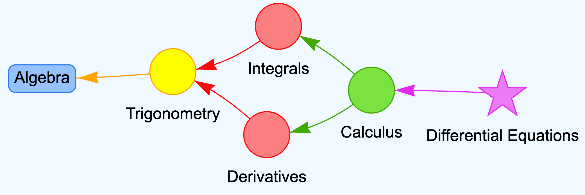

# Concept Dependency



<!-- Sample Prompt 
I am writing a book on "Learning Graphs" where we use generative AI to create concept dependency graphs. Our chapters are: 
1. What are Learning Graphs (Done) 
2. Learning Concept and SKOS (Done) 
3. Bloom's Taxonomy (Done) 
4. Concept Dependency 

Please help me write a the chapter called "Concept Dependency". In this chapter you can assume the reader already knows what learning graphs are, what Learning Concepts are, and how Bloom's Taxonomy can be used to order Learning Concepts. Now, please help me write a detailed chapter on Concept Dependencies. Talk about Foundational Concepts (Prerequisites) and Learning Goals and how these concepts can be ordered using a dependency graph.

-->

In this chapter, we will explore the core of learning graphs: how concepts are interrelated and how those relationships can be visualized in a dependency graph. You've already been introduced to Learning Concepts and Bloom's Taxonomy, so we'll focus on structuring these concepts based on their inherent dependencies. This will allow educators, learners, and AI-driven systems to generate a pathway through a body of knowledge, ensuring that foundational concepts (prerequisites) are learned before more advanced ideas are introduced.


### Understanding Concept Dependencies

Concept dependencies refer to the relationships between various [learning concepts](../glossary.md#concept), where one concept must be understood before another can be fully grasped. Just as in building a house, where you need a solid foundation before constructing the walls, in learning, certain foundational concepts need to be mastered before more advanced ones are introduced.

A **dependency graph** illustrates these relationships by placing foundational concepts as prerequisites and showing the pathways that lead from basic understanding to advanced learning goals. Each node in the graph represents a learning concept, and the directed edges show the dependencies between them. This way, a learner or an educator can navigate through a structured sequence, ensuring all required knowledge is obtained progressively.

### Foundational Concepts (Prerequisites)

Foundational concepts form the base of any learning graph. These are the ideas or skills that a learner must acquire first to build towards more complex or specialized topics. Without a firm grasp of these, learners often struggle to progress.

**Example:** In a math curriculum, understanding basic algebra is a foundational concept before attempting to learn calculus. Without algebra, calculus would be incomprehensible because many of its principles are rooted in algebraic manipulation.

#### Identifying Prerequisites

A key step in constructing a concept dependency graph is identifying the foundational concepts or prerequisites for a particular learning goal. To do this, an instructor or AI system may:

-   Analyze the knowledge required for a given task or topic and work backward to find the simplest concepts that must be understood.
-   Use **Bloom's Taxonomy** to ensure that lower-level cognitive skills (e.g., knowledge, comprehension) are addressed before higher-level skills (e.g., synthesis, evaluation).
-   Consult existing educational frameworks like **SKOS** (Simple Knowledge Organization System) to structure these relationships.

Dependencies are not always linear. Some concepts might have multiple prerequisites, while others might lead to a variety of advanced learning goals. The goal of a dependency graph is to map out these relationships clearly.

### Learning Goals

While foundational concepts form the base, **learning goals** are the milestones or outcomes that a learner strives to achieve. Learning goals typically represent the higher-order concepts within the graph. These are the end points in the learning journey, where learners apply their knowledge in real-world contexts, solve complex problems, or demonstrate mastery over a subject.

Learning goals can be structured across multiple levels. For instance:

-   **Immediate goals**: Mastering a concept that serves as a building block for further learning.
-   **Intermediate goals**: Acquiring skills that allow for more sophisticated understanding.
-   **Ultimate goals**: Achieving proficiency that allows learners to tackle real-world challenges or expert-level problems.

In a dependency graph, these learning goals might appear toward the right side (if you imagine the graph flowing from left to right), while foundational concepts would be on the left. The edges in the graph show the learner's path through intermediate concepts, from the foundations toward their ultimate learning goals.

### Ordering Concepts Using a Dependency Graph

Creating an ordered structure for learning involves placing concepts in a sequence that respects the dependencies between them. The goal is to create a smooth progression where learners build on prior knowledge without facing gaps.

1.  **Define the foundational concepts**: Start by identifying the most basic concepts that learners need to understand. These will be positioned at the far left of the graph.

2.  **Identify intermediate concepts**: Determine the concepts that rely on these foundational ideas. These will sit in the middle of the graph, acting as bridges between the base concepts and the more advanced learning goals.

3.  **Set learning goals**: Establish the final, most advanced concepts. These will represent the culmination of the learner's journey and often involve synthesizing knowledge from several intermediate areas.

4.  **Draw dependencies**: The edges connecting the nodes (concepts) in the graph represent the knowledge dependencies. They show that one concept must be learned before another. By tracing the path through these edges, you can clearly see the required learning trajectory.

5.  **Consider feedback loops**: Not all learning is purely linear. Some advanced concepts might lead learners to revisit foundational ideas at a deeper level. These feedback loops can be added to the graph to represent cyclical learning processes.

### Practical Example

Let's imagine constructing a concept dependency graph for an introductory computer programming course:

-   **Foundational Concepts**: Variables, basic syntax, control flow (if statements, loops).
-   **Intermediate Concepts**: Functions, data structures (arrays, lists), error handling.
-   **Learning Goals**: Algorithm design, problem-solving with recursion, and object-oriented programming.

The graph would begin with basic syntax and variables as foundational concepts, then flow into control flow and functions. From functions, learners could move on to data structures, which would eventually lead them to algorithm design. By the time learners reach the learning goal of recursion, they would have mastered the prerequisite skills to understand and apply it effectively.

### Concept Dependency in Adaptive Learning Systems

One of the key benefits of creating a concept dependency graph is its application in adaptive learning systems. Generative AI can use these graphs to tailor learning experiences to individual students, ensuring that they are introduced to concepts in the correct order. For instance, if a learner struggles with an intermediate concept, the system can direct them back to the foundational concept that they need to reinforce.

### Structural Checks

When constructing a concept dependency graph, it's essential to ensure that the structure is complete, coherent, and connected. Without proper structural checks, gaps in the graph could lead to missing or disjointed learning pathways, making it difficult for learners to progress logically from one concept to the next. In this section, we will discuss three key structural checks: ensuring the presence of foundational concepts and learning goals, verifying that every concept is connected to the graph, and eliminating "orphan nodes."

#### Check 1: Ensure At Least One Foundational Concept

A well-formed concept dependency graph must have at least one foundational concept. These concepts serve as the entry points for learning and should be positioned at the base of the graph. Without foundational concepts, learners would have no starting point, which would undermine the structure of the learning pathway.

**Check:** Review your graph to confirm that there are one or more concepts that do not depend on any other nodes. These concepts should be at the far left of the graph (in a left-to-right representation) or at the top (if using a top-down layout). They represent the starting point of the learning journey.

#### Check 2: Ensure At Least One Learning Goal

While foundational concepts form the base, the graph should also culminate in at least one learning goal. Learning goals are the ultimate objectives that learners are working toward, representing the most advanced concepts in the graph.

**Check:** Ensure that the graph has at least one concept that represents a learning goal, positioned at the far right (or bottom) of the graph. These should be nodes that no other concepts depend on, indicating that they are the end points of the learning journey.

#### Check 3: Eliminate "Orphan Nodes"

One of the most critical structural checks is to ensure that there are no "orphan nodes" in the graph. An orphan node is a concept that is isolated from the rest of the graph, with no connections (edges) linking it to other concepts. Orphan nodes disrupt the learning flow, as they represent knowledge that is either unconnected to the foundational concepts or unhelpful for achieving the learning goals.

**Check:** Examine the graph to verify that every concept is connected to at least one other concept via an edge. Each node should either have a prerequisite or be a prerequisite for another concept. If any concept lacks connections, you must investigate why and either remove it from the graph or establish the appropriate connections.

#### Check 4. Verify Full Coverage of the Learning Path

A final structural check is to ensure that the graph provides a full, connected learning path from foundational concepts to learning goals. There should be a clear progression from one side of the graph to the other, where learners can start with the most basic concepts and build up toward mastery.

**Check:** Trace multiple paths through the graph from the foundational concepts to the learning goals. This will help you confirm that learners can follow a continuous sequence of concepts and that no intermediate concepts are skipped. Each concept should serve as either a stepping stone to more advanced topics or as a prerequisite for building necessary knowledge.

#### Summary of Structural Checks

Structural checks are vital for ensuring the integrity of a concept dependency graph. By verifying the presence of foundational concepts and learning goals, eliminating orphan nodes, and ensuring all concepts are connected, you can create a well-structured and cohesive learning pathway. These checks not only enhance the flow of knowledge but also ensure that learners have a clear, progressive route through the subject matter without facing gaps or isolated ideas. In both traditional and AI-driven learning environments, performing structural checks is crucial for optimizing the effectiveness of the graph.

Add one more section called "Generating Dependency Graphs with Large-Language-Models". Talk about how a list of concepts can be an input, and the LLM can then be used to generate a draft of the concept dependencies using the appropriate prompt. The prompt should contain: 1. The list of Concepts 2. Instructions for adding Concept Dependencies for each concept 3. Checks for Foundational Concepts (prerequisites) 4. Checks for Learning Goals 5. Checks for duplication and avoidance of orphaned nodes Generate a sample prompt use for a large-langauge model.

### Generating Dependency Graphs with Large-Language Models

One of the most powerful applications of Large Language Models (LLMs) in education is their ability to assist in the generation of concept dependency graphs. By inputting a list of learning concepts, an LLM can draft the relationships between them, identifying which concepts are foundational, intermediate, and learning goals. This enables instructors, curriculum designers, and AI systems to quickly scaffold a structured learning pathway.

Using LLMs, you can generate these dependencies through a carefully constructed prompt, which not only lists the concepts but also provides specific instructions for the LLM to organize them into a coherent dependency graph. In this section, we'll explore how to craft such a prompt and leverage LLMs to check for structural integrity, such as ensuring there are no orphaned nodes, that all prerequisites are included, and that learning goals are clearly defined.

#### Creating the Prompt

To generate a concept dependency graph using an LLM, the following elements should be included in the prompt:

1.  **List of Concepts**: Begin by providing the LLM with a list of concepts that need to be organized.
2.  **Instructions for Adding Concept Dependencies**: Guide the LLM to identify which concepts are prerequisites and which are advanced learning goals.
3.  **Check for Foundational Concepts**: Ensure that the LLM starts with the most basic ideas, identifying concepts that do not depend on others.
4.  **Check for Learning Goals**: Ask the LLM to identify the ultimate learning objectives that serve as end points in the learning pathway.
5.  **Avoidance of Orphan Nodes**: Instruct the LLM to verify that all concepts are connected, ensuring that there are no isolated, unlinked concepts in the graph.
6.  **Check for Duplications**: Make sure that the LLM doesn't introduce duplicate concepts or redundant dependencies.

### Sample Prompt for LLM

Below is an example prompt that could be used to generate a concept dependency graph using an LLM:


**Prompt:**

```linenums="0"
You are given the following list of concepts. Your task is to
generate a concept dependency graph where each concept is
placed according to its dependencies. Each concept should
either depend on one or more prerequisites or be a prerequisite
for others. You must check for the following:

-   Identify at least one foundational concept that serves
as a starting point. These concepts should not depend on others.
-   Identify at least one learning goal that serves as the end point of the graph. These concepts should not have any dependencies and represent the most advanced topics.
-   Ensure there are no "orphan nodes" (concepts without any connections).
-   Avoid duplicating concepts or introducing redundant relationships.

**List of Concepts:**

1.  Basic Algebra
2.  Calculus
3.  Trigonometry
4.  Graph Theory
5.  Differential Equations
6.  Linear Algebra
7.  Functions and Relations
8.  Derivatives
9.  Integrals

**Instructions:**

1.  Begin by identifying the foundational concepts (prerequisites) that serve as the base of the graph.
2.  For each concept, specify its prerequisites. For example, calculus depends on understanding basic algebra, functions and relations, and trigonometry.
3.  Identify the learning goals, which should appear as advanced concepts with no further dependencies. In this case, consider topics like graph theory or differential equations.
4.  Ensure that each concept is connected, forming a continuous learning path from foundational concepts to learning goals.
5.  Verify that no concepts are duplicated or incorrectly connected.
```

#### How LLMs Use This Prompt

When provided with a prompt like the one above, an LLM can analyze the list of concepts, draw logical connections, and generate a draft of the concept dependency graph. The model will:

-   Place basic algebra as a foundational concept because it is a prerequisite for most other topics.
-   Connect calculus, derivatives, and integrals with algebra, functions, and trigonometry.
-   Assign learning goals such as differential equations and graph theory as advanced concepts that rely on prior knowledge from calculus and linear algebra.
-   Ensure that every concept has at least one connection to other nodes, eliminating orphan nodes.
-   Perform structural checks to avoid redundancy or disconnection in the graph.

This process significantly reduces the manual effort required to map out dependencies, allowing educators and AI systems to focus on refining and enhancing the learning experience rather than spending time identifying prerequisites.

### Sample Response

To generate a concept dependency graph based on the given list of concepts, we will first identify foundational concepts, establish the dependencies, and then determine learning goals. Here's how we can organize the dependencies step-by-step:

### Foundational Concepts (Prerequisites):

1.  **Basic Algebra** -- This is a foundational concept that doesn't depend on other concepts and serves as the base for many other mathematical topics.
2.  **Functions and Relations** -- Another fundamental concept that underpins understanding more advanced topics in mathematics.

### Intermediate Concepts:

1.  **Trigonometry** -- Depends on both **Basic Algebra** and **Functions and Relations** for its mathematical foundations.
2.  **Linear Algebra** -- Requires **Basic Algebra** and **Functions and Relations** to understand matrices, vectors, and their operations.
3.  **Derivatives** -- Depends on **Basic Algebra**, **Functions and Relations**, and **Trigonometry**. Derivatives are a key part of calculus and rely on these foundational topics.
4.  **Integrals** -- Depends on **Derivatives**, **Basic Algebra**, and **Trigonometry**. Mastering integrals requires a strong understanding of the prerequisite topics that lead to calculus.

### Advanced Concepts (Learning Goals):

1.  **Calculus** -- This advanced concept depends on **Basic Algebra**, **Trigonometry**, and **Functions and Relations**. It leads to understanding derivatives and integrals.
2.  **Differential Equations** -- This is a learning goal that builds on **Calculus** and **Linear Algebra**. It requires a thorough understanding of these concepts but does not introduce new prerequisites.
3.  **Graph Theory** -- This advanced topic depends primarily on **Linear Algebra** but stands alone in many respects. It serves as an end point in certain mathematical learning paths.

### Graph Overview:

1.  **Basic Algebra** → **Functions and Relations** → **Trigonometry**
2.  **Basic Algebra** → **Linear Algebra**
3.  **Functions and Relations** → **Derivatives** → **Integrals**
4.  **Trigonometry** → **Derivatives**
5.  **Derivatives** → **Calculus** → **Differential Equations**
6.  **Linear Algebra** → **Graph Theory**

### Continuous Path:

-   The graph starts with **Basic Algebra** and **Functions and Relations**, which flow into **Trigonometry** and **Linear Algebra**. From there, **Derivatives** and **Integrals** lead into **Calculus**, which then extends into more specialized topics like **Differential Equations** and **Graph Theory**.

### No Orphan Nodes:

-   All concepts are connected, with clear dependencies between them. There are no orphan nodes, ensuring that each concept either builds on or leads to another concept.

### No Redundancies:

-   Each concept is introduced only once, and the dependencies are logically structured without duplication or redundant relationships.

This approach creates a well-ordered and connected concept dependency graph, ensuring that learners progress logically through the material from foundational concepts to advanced learning goals.

### Conclusion

Using LLMs to generate concept dependency graphs streamlines the design of learning pathways. With a well-constructed prompt, LLMs can map foundational concepts, intermediate ideas, and learning goals, ensuring that all concepts are connected in a coherent structure. This method not only accelerates the creation of dependency graphs but also ensures that the structure is complete, eliminating orphaned nodes and redundancies.

## Data Formats for Concept Dependency Lists

In this course, we will use two difference file formats
for storing our learning graphs:

1. **CSV Format** - this format is simple and easy for beginners to create with
a spreadsheet or text editor.  It is also easy for generative AI tools to generate.
Just be aware that you must use quotes to surround names that contain commas.
2. **JSON Format** - this format is easy for tools like vis.js to read and view.
There are also tools to validate this format for correctness.

We also proved Python tools to convert between these formats.
See the "src/csv-to-json" area of this repo for examples of these tools.

### CSV Format

```csv
ConceptID,ConceptName,DependentConceptIDs
1,Basic Algebra,2|3|4|5
2,Functions and Relations,3|5
3,Trigonometry,5
4,Linear Algebra,7|9
5,Derivatives,6
6,Integrals,
7,Calculus,8
8,Differential Equations,
9,Graph Theory,
```

Note that the last two foundational concepts do not have dependencies.

### JSON Format

```json
{"nodes": [
    {"id": 1, "label": "Basic Algebra"},
    {"id": 2, "label": "Functions and Relations"},
    {"id": 3, "label": "Trigonometry"},
    {"id": 4, "label": "Linear Algebra"},
    {"id": 5, "label": "Derivatives"},
    {"id": 6, "label": "Integrals"},
    {"id": 7, "label": "Calculus"},
    {"id": 8, "label": "Differential Equations"},
    {"id": 9, "label": "Graph Theory"}],
"edges": [
    {"from": 1, "to": 2}, 
    {"from": 1, "to": 3}, 
    {"from": 1, "to": 4}, 
    {"from": 2, "to": 3}, 
    {"from": 2, "to": 5}, 
    {"from": 3, "to": 5}, 
    {"from": 4, "to": 7}, 
    {"from": 4, "to": 9}, 
    {"from": 5, "to": 6}, 
    {"from": 7, "to": 8}
]}
```

### Conclusion

Concept dependency is the backbone of any structured learning experience. By understanding the relationships between foundational concepts and learning goals, educators can create clearer, more effective pathways for learners. These paths can be visualized and utilized through concept dependency graphs, which not only provide a roadmap for the learner but also help AI systems tailor education to meet individual needs.

A well-constructed concept dependency graph ensures that learning is progressive, avoids gaps, and builds toward meaningful goals. Whether you're developing a curriculum or designing an adaptive learning system, understanding and applying concept dependency will ensure that learners can build a solid foundation for advanced understanding and success.
