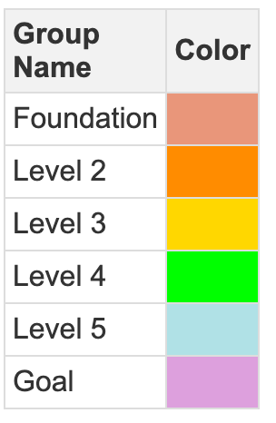

# Concept Taxonomies and Ontologies

<!--
I am writing a book on "Learning Graphs" where we use generative AI to create concept dependency graphs.  Our chapters so far are:

1. What are Learning Graphs (Done)
2. Learning Concept and SKOS (Done)
3. Bloom's Taxonomy (Done)
4. Concept Dependency (Done)
5. Concept Taxonomies and Ontologies

Please help me write a the chapter called "Concept Taxonomies and Ontologies".
In this chapter you can assume the reader already knows what learning graphs are,
what Learning Concepts are, and how Bloom's Taxonomy can be used to order
Learning Concepts and what Concept Dependency graphs are.

Now, please help me write a detailed chapter on "Concept Taxonomies and Ontologies".
Talk about how concepts can be grouped together according to their type or
classification.  For example some concepts might be:

1. basic terminology
2. mathematical concepts
3. recurring patterns
4. anti-patterns (things to avoid)
5. common misunderstanding
6. illustrations
7. useful metaphors
8. stories or case studies
9. application of concepts to real world problems
10. warnings about appropriate use
11. hands-on activities
12. simulations

Describe how classifying concepts can help curriculum authors
design courses and intermix abstract concepts with concrete
examples to reinforce learning.
-->

In this chapter, we will explore how concepts can be grouped and classified using taxonomies and ontologies. By organizing concepts into meaningful categories, curriculum designers can create richer learning experiences. Taxonomies and ontologies help structure learning content, making it easier to intermix abstract theories with concrete examples, reinforcing learning through diverse types of engagement.

## Concept Taxonomies

A **taxonomy** is a structured classification of concepts into categories or types, typically in a hierarchical arrangement. In education, concept taxonomies help group ideas based on shared characteristics, making it easier to design a curriculum that balances foundational knowledge with higher-order thinking.

### Classifying Concepts in a Taxonomy

In the context of a learning graph, concepts can be classified in a variety of ways. Below are some common categories that can be used to classify educational content:

1.  **Basic Terminology**: Concepts that define the core vocabulary of a subject. These serve as building blocks for further understanding. For example, in a computer science course, terms like "algorithm," "data structure," or "function" would belong here.

2.  **Mathematical Concepts**: These are abstract ideas that rely on logic and mathematics. They are foundational for many fields, such as physics, economics, or engineering. Concepts like "linear algebra," "calculus," and "probability theory" would be part of this category.

3.  **Recurring Patterns**: These are general principles or patterns that appear across different contexts. Examples include "design patterns" in software development or "behavioral patterns" in psychology.

4.  **Anti-patterns**: These are practices or ideas that may seem beneficial but should be avoided. For example, "premature optimization" in coding or "confirmation bias" in decision-making.

5.  **Common Misunderstandings**: Concepts that are often misunderstood or misapplied. These can serve as important checkpoints in a learning journey, ensuring that students overcome pitfalls.

6.  **Illustrations**: These are visual representations of concepts, such as diagrams, charts, and graphs. For example, in physics, an illustration of Newton's laws using a force diagram helps learners visualize abstract ideas.

7.  **Useful Metaphors**: Metaphors can simplify complex topics by comparing them to something familiar. For instance, describing "RAM" in computing as a "workspace" where immediate tasks are performed.

8.  **Stories or Case Studies**: Real-world stories or case studies that show how concepts are applied in practice. These are crucial for reinforcing theoretical knowledge with practical examples.

9.  **Application of Concepts to Real-World Problems**: This involves showing learners how abstract concepts translate into real-world solutions. For instance, how linear algebra is used in 3D modeling or how probability is applied in risk assessment.

10.  **Warnings about Appropriate Use**: These are concepts that warn learners about the limitations or potential misuse of an idea. For example, cautioning students about overfitting in machine learning models.

11.  **Hands-on Activities**: These include experiments, labs, or other interactive activities that allow learners to engage directly with the material. Building a simple circuit or conducting a chemistry experiment are examples.

12.  **Simulations**: Simulations provide a dynamic environment where learners can experiment with different scenarios and see how concepts behave in real time. For example, using software to simulate population growth or stock market fluctuations.

## The Role of Taxonomies in Course Design

By organizing concepts into a taxonomy, curriculum authors can carefully design a balanced course that introduces learners to a mix of theoretical and practical concepts. The taxonomy allows instructors to move between different levels of abstraction, ensuring that learners don't get bogged down in too much theory without seeing its real-world application.

**Example:** In a course on electrical engineering, the taxonomy might look like this:

-   **Basic Terminology**: Voltage, Current, Resistance
-   **Mathematical Concepts**: Ohm's Law, Kirchhoff's Laws
-   **Hands-on Activities**: Building a simple circuit using resistors and an LED
-   **Illustrations**: Circuit diagrams, flow of current representation
-   **Simulations**: Using a circuit simulator to test different configurations
-   **Warnings**: The dangers of working with high voltage or improper grounding

A well-designed course would cycle between these classifications, providing learners with varied opportunities to engage with the material.

## Concept Ontologies

While taxonomies organize concepts into hierarchical groups, **ontologies** take this a step further by explicitly defining the relationships between concepts. In other words, an ontology not only classifies concepts but also explains how they are related to one another. In the context of learning, this could mean defining how one concept depends on another, how concepts are grouped, and how they fit into a broader body of knowledge.

### Ontologies in Learning Graphs

Ontologies can help clarify the dependencies and relationships between learning concepts, ensuring that no important connections are overlooked. For example:

-   **Concept A depends on Concept B**: In a physics course, Newton's Second Law (Concept A) depends on an understanding of force and mass (Concept B).
-   **Concept C is a prerequisite for Concept D**: In calculus, understanding derivatives (Concept C) is necessary before tackling integrals (Concept D).

Ontologies allow for more complex relationships beyond simple prerequisites. They can capture nuanced relationships such as:

-   **Concept E complements Concept F**: In literature, understanding symbolism (Concept E) complements the study of metaphor (Concept F).
-   **Concept G contrasts with Concept H**: In a philosophy course, the idea of free will (Concept G) contrasts with determinism (Concept H).

### Practical Applications of Taxonomies and Ontologies

By integrating taxonomies and ontologies, curriculum designers can develop richer learning experiences. Here's how these frameworks enhance learning:

1.  **Customization and Differentiation**: By identifying various types of concepts, instructors can tailor learning experiences to different learners' needs. Some students may excel with hands-on activities, while others may grasp abstract concepts more easily. A taxonomy of concept types helps create a varied learning experience.

2.  **Interweaving Theory and Practice**: Using a taxonomy to intermix abstract concepts with case studies, metaphors, or hands-on activities can reinforce learning. A lesson on programming algorithms might alternate between introducing the theory (taxonomy: mathematical concept) and showing real-world applications (taxonomy: application of concepts to real-world problems).

3.  **Adaptive Learning**: Ontologies, with their detailed relationships between concepts, are particularly useful for adaptive learning systems. As learners master foundational concepts, the system can automatically guide them to more advanced topics, ensuring that they progress along a logical path.

4.  **Reducing Misunderstandings**: By including "common misunderstandings" and "warnings" in a taxonomy, educators can proactively address areas where learners typically struggle, minimizing confusion.

## Concept Taxonomy Legends



## Using a groups.json File

In our labs, we will often generate a small taxonomy of around 10 classifiers.
We then want to use these classifiers to display concepts is a way that
allow our authors to see patterns in complex learning graphs.  We have
adopted a standard format for storing taxonomies called the groups.json format.

For each category or group, we can store the following properties:

1. The background and border color of each **unselected** node
2. The background and border color of each node when you **hover** your mouse over the node
3. The background and border color of each node when you **select** the node
4. The shape and size of the node.  For example we use "box" for foundation nodes
and star for course goals

Here is an example of this format:

```json
{
    "Foundation": {
        "color": {
            "background": "DarkSalmon",
            "border": "FireBrick",
            "highlight": {
                "background": "LightSalmon",
                "border": "DarkRed"
            },
            "hover": {
                "background": "Salmon",
                "border": "DarkRed"
            }
        },
        "shape": "dot",
        "size": 20
    },
    "Level 2": {
        "color": {
            "background": "DarkOrange",
            "border": "OrangeRed",
            "highlight": {
                "background": "orange",
                "border": "Tomato"
            },
            "hover": {
                "background": "LightSalmon",
                "border": "Coral"
            }
        },
        "shape": "dot",
        "size": 20
    },
    "Goal": {
        "color": {
            "background": "plum",
            "border": "purple",
            "highlight": {
                "background": "violet",
                "border": "mediumorchid"
            },
            "hover": {
                "background": "LightSteelBlue",
                "border": "SteelBlue"
            }
        },
        "shape": "dot",
        "size": 20
    }
}
```


## Conclusion

Classifying concepts using taxonomies and ontologies provides a structured framework that enhances the design of learning experiences. Taxonomies offer a way to group concepts into manageable categories, ensuring that courses balance abstract theory with concrete examples. Ontologies, on the other hand, define relationships between concepts, ensuring that dependencies and connections are clearly mapped.

Together, these tools allow curriculum authors to design courses that are not only logically structured but also rich in variety and engagement. By integrating both frameworks into learning graphs, educators can create more personalized and effective learning paths, ensuring that students have the opportunity to master concepts both in theory and in practice.