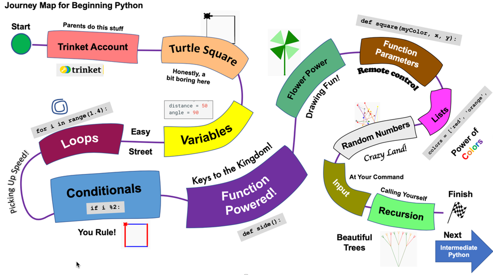

# Glossary of Terms

#### Adaptive Learning

A method of delivering personalized learning experiences by dynamically adjusting the content, pace, and instructional approach in response to an individual learner's performance, needs, and preferences.

**Example:** An adaptive learning system uses a concept graph to create customized content for a student. After analyzing the student’s responses to assessment questions, the system identifies specific areas where the student needs more practice. Based on the student's performance and the relationships between concepts in the graph, it selects appropriate materials, such as videos, exercises, or explanations, focusing on strengthening the weaker concepts before advancing to more complex topics. The system continually updates the content based on the student's progress.

#### Agent

An autonomous entity capable of perceiving its environment, processing inputs, and taking actions to achieve specific goals or objectives, often with the ability to adapt or learn from experience.

**Example:**  An intelligent agent in an educational platform uses a learning graph to create a customized lesson plan for students. Based on the results of the prior week's quiz and a predefined learning objective, the agent identifies key concepts where students struggled and selects activities that reinforce those concepts. The lesson plan adapts to each student's individual learning needs, ensuring that the content aligns with their current understanding and progress.

* Also known as: Intelligent Agent

#### Alternate Label

A synonym or alternative term used to represent the same concept within a given context, providing additional ways to reference or describe the concept without altering its meaning.

**Example:** In a learning system, alternative labels are used to provide alternate names for learning concepts. For instance, the concept of "addition" in mathematics may have alternative labels such as "summing" or "totaling." These alternative labels allow students or teachers to reference the same concept using different terminology, accommodating variations in language or teaching style without changing the underlying concept.

#### Bloom's Taxonomy

#### Concept

A fundamental unit of knowledge, representing an abstract idea or a mental construct that can be described, categorized, and related to other concepts within a domain.

**Example:** In an educational setting, the concept of "photosynthesis" represents the process by which plants convert light energy into chemical energy, and it can be related to concepts such as "sunlight," "chlorophyll," and "carbon dioxide."

#### Concept Dependency

A relationship between two or more concepts where the understanding of one concept is required before another can be fully understood or applied.

**Example:** The concept of "multiplication" is dependent on the understanding of "addition," as multiplication is often described as repeated addition. Therefore, "addition" is a prerequisite for learning "multiplication."

#### Concept Dependency Graph

A visual representation of the relationships between concepts, where nodes represent individual concepts and directed edges indicate dependencies between them, showing how the mastery of one concept is necessary before another.

**Example:** In a concept dependency graph for an algebra course, "solving linear equations" may depend on the prior understanding of "basic arithmetic operations" and "variables." This graph helps to design learning paths for students based on their current knowledge.

#### Directed Graph

A graph consisting of nodes (vertices) connected by edges (arcs) that have a specific direction, indicating a one-way relationship between the nodes.

**Example:** A directed graph representing traffic flow in a city could have intersections as nodes and one-way streets as directed edges, showing how vehicles can travel from one intersection to another.

#### Foundational Concepts

Basic or essential concepts that serve as the building blocks for understanding more complex ideas or advanced knowledge within a domain.

**Example:** In mathematics, "number sense" and "basic arithmetic" are foundational concepts for understanding more advanced topics such as algebra and calculus.

#### Generative AI

A type of artificial intelligence capable of producing new content, such as text, images, or other data, by learning patterns from existing data and generating outputs that follow those patterns.

**Example:** A generative AI model can create personalized learning materials by analyzing a student's previous responses and generating explanations, questions, or study guides tailored to their learning progress.

#### Hyper-Personalization

The process of creating highly individualized experiences or content by leveraging advanced data analysis and machine learning to tailor recommendations, content, and interactions based on unique characteristics of the user.

**Example:** In an online learning platform, hyper-personalization is used to generate lesson plans based on a student's learning preferences, quiz performance, and real-time concept mastery, creating a unique learning path for each student.

#### ISO Definition

A term definition is considered to be consistent with ISO/IEC 11179 metadata registry guideline if it meets the following criteria:

1. Precise
2. Concise
3. Distinct
4. Non-circular
5. Unencumbered with business rules

#### Journey Map

A visual or structured representation of an individual's experience as they move through a sequence of steps, interactions, or stages to achieve a specific goal, often used to identify [touchpoints](#touchpoint), challenges, and opportunities for improvement.

**Example:** A journey map for a student's learning process can be derived from a learning concept graph. For instance, the graph shows the required concepts to master "calculus," such as "basic arithmetic" and "algebra." A journey map can be created that outlines the student's progression through these concepts, highlighting key milestones, struggles, and recommended interventions at each stage to ensure the successful understanding of calculus.

#### Learning Graph

A network graph that stores learning [Concepts](#concept) and their dependencies.

Learning graphs are a type of [Directed Graphs](#directed-graph) where every node is a learning Concept
and every edge is a concept dependency or prerequisite.

#### Learning Management System (LMS)

A software platform designed to deliver, manage, and track educational content and activities, enabling learners to access courses, assessments, and other instructional resources, while providing tools for instructors to monitor progress and performance.

**Example:** An LMS can use a learning graph to create customized lesson plans by analyzing a student's performance on past quizzes and identifying gaps in their understanding. For example, if a student demonstrates a weak grasp of "fractions" in a math course, the LMS can automatically adjust the lesson plan by offering additional exercises, videos, or tutorials on that specific concept before progressing to more advanced topics like "algebra." This personalized approach ensures that each student follows a learning path tailored to their individual needs.

#### Learning Objective

A specific, measurable goal that defines what a learner should know or be able to do by the end of a lesson, course, or training program.

**Example:** A learning objective for a biology class might be: "Students will be able to explain the process of cellular respiration and identify its stages."

#### Learning Path

A structured sequence of learning activities, materials, or modules designed to guide a learner through progressively more advanced content to achieve a specific learning goal.

**Example:** A learning path for mastering algebra might start with basic arithmetic, followed by lessons on solving equations, and then advance to systems of equations and quadratic functions.

#### MicroSim

A small stand-alone educational simulation of a concept.  MicroSims
are designed to be easy for generative AI agents to create and
modify to accommodate the individual needs of students.

See also: [MicroSims Website](https://dmccreary.github.io/microsims/)

#### Node Group

A collection of interconnected nodes within a graph that share common characteristics or relationships, often treated as a unit for analysis or visualization.

**Example:** In a concept dependency graph, a node group could represent all the foundational concepts needed for understanding calculus, such as "algebra," "trigonometry," and "functions."

* Also know as: Community
* Also know as: Cluster

#### Preferred Label

The preferred name of a [Concept](#concept).

In general, a concept has one and only one preferred name per language such as English, but a Concept
may have many alternate labels.

Within a learning graph, no two Concepts should have the same preferred name.

#### Rhizombic Learning

An educational model inspired by the way rhizomes grow and spread, allowing for non-linear, interconnected, and expansive pathways of knowledge acquisition.

The Rhizombic Learning approach contrasts with traditional hierarchical or linear models, focusing instead on exploration, connection, and adaptability.  Learning graphs are ideal
tools to encourage the curious leaner.

#### SKOS

A W3C standard for representing structured knowledge in a simple, machine-readable format, allowing for the sharing and linking of controlled vocabularies, taxonomies, thesauri, and other knowledge organization systems across different systems and applications.

**Example:** SKOS can be used to exchange learning graphs by encoding the relationships between educational concepts as a set of SKOS concepts and properties. For instance, a graph that shows the dependency between "basic arithmetic," "algebra," and "calculus" can be expressed using SKOS, with "broader" and "narrower" properties to define the hierarchy and concept relationships. This allows different educational platforms to share and reuse the same structure for organizing learning materials.

Note that SKOS is ideal for storing taxonomies and ontologies, but is not use for showing learning order dependencies.

* Also Known as: Simple Knowledge Organization System

#### Touchpoint

An interaction or moment of engagement between a learner and a learning management system (LMS), typically associated with key stages in the learning process where progress, feedback, or guidance is provided.

Example: In a learning management system built around a learning graph, touchpoints occur when a student completes a quiz, views instructional content, or seeks help on a specific concept. By analyzing these touchpoints, instructors can identify where students frequently encounter difficulties or disengage. Touchpoint analysis might reveal that many students struggle with "fractions" before advancing to "algebra," allowing instructors to redesign the course by adding additional resources or alternative explanations at that critical stage, improving student success.

#### Vis.js

A JavaScript library for visualizing graph networks.

See: [https://visjs.github.io/vis-network/docs/network/](https://visjs.github.io/vis-network/docs/network/)