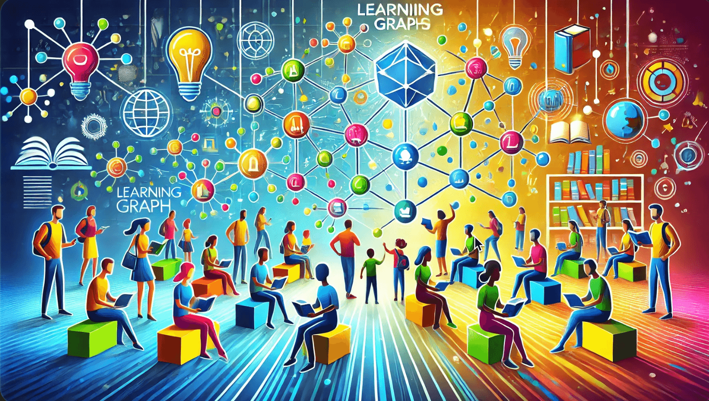

# Learning Graphs

Welcome to the website for Learning Graphs.  Learning
Graphs are [concept dependency graphs](glossary/#concept-dependency-graph) that are used to:

1. Understand the important [concepts](glossary#concept) in a course and their dependencies
2. Suggest [learning paths](glossary#learning-path) to achieve [learning objectives](glossary#learning-objective)
3. Serve as the core data structure for [hyper-personalization](glossary#hyperpersonalization) of lesson plans by [generative AI](glossary#generative-ai) [agents](glossary#agent).

Please see the [About This Site](./about.md) for more details.

Please contact me on [LinkedIn](https://www.linkedin.com/in/danmccreary/)

Thanks! - Dan

