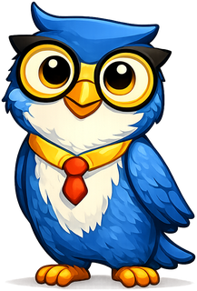
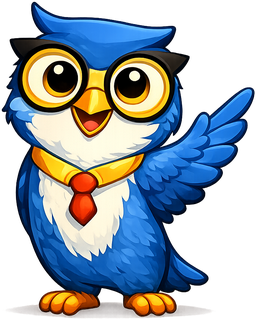
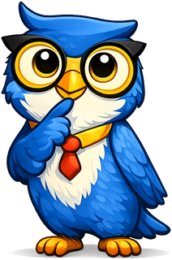
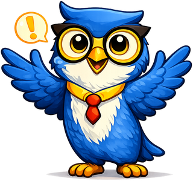
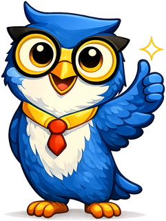

# Mascot Style Guide

This page shows all mascot admonition styles for reference. See
[`docs/img/mascot/character-sheet.md`](../../img/mascot/character-sheet.md) for
Axiom's full identity, voice, and pose documentation.

!!! mascot-neutral "General Note"
    { class="mascot-admonition-img" }
    This is the neutral style, used for general sidebars or introductions.

!!! mascot-welcome "Welcome!"
    { class="mascot-admonition-img" }
    This is the welcome style, used at chapter openings. "Let's connect the concepts!"

!!! mascot-explain "Let Me Explain"
    { class="mascot-admonition-img" }
    This is the explain style, used for concept clarification and walkthrough steps. It's an extra pose beyond the base seven, carried over from Axiom's original design.

!!! mascot-thinking "Key Insight"
    { class="mascot-admonition-img" }
    This is the thinking style, used for key concepts and reflective, analytical passages.

!!! mascot-tip "Helpful Tip"
    { class="mascot-admonition-img" }
    This is the tip style, used for hints, best practices, and MicroSim exploration guidance.

!!! mascot-warning "Watch Out!"
    { class="mascot-admonition-img" }
    This is the warning style, used for common mistakes — gentle, never alarming.

!!! mascot-encourage "Keep Going!"
    { class="mascot-admonition-img" }
    This is the encouraging style, used for difficult content and persistence messaging.

!!! mascot-celebration "Well Done!"
    { class="mascot-admonition-img" }
    This is the celebration style, used for achievements and end-of-chapter mastery.
