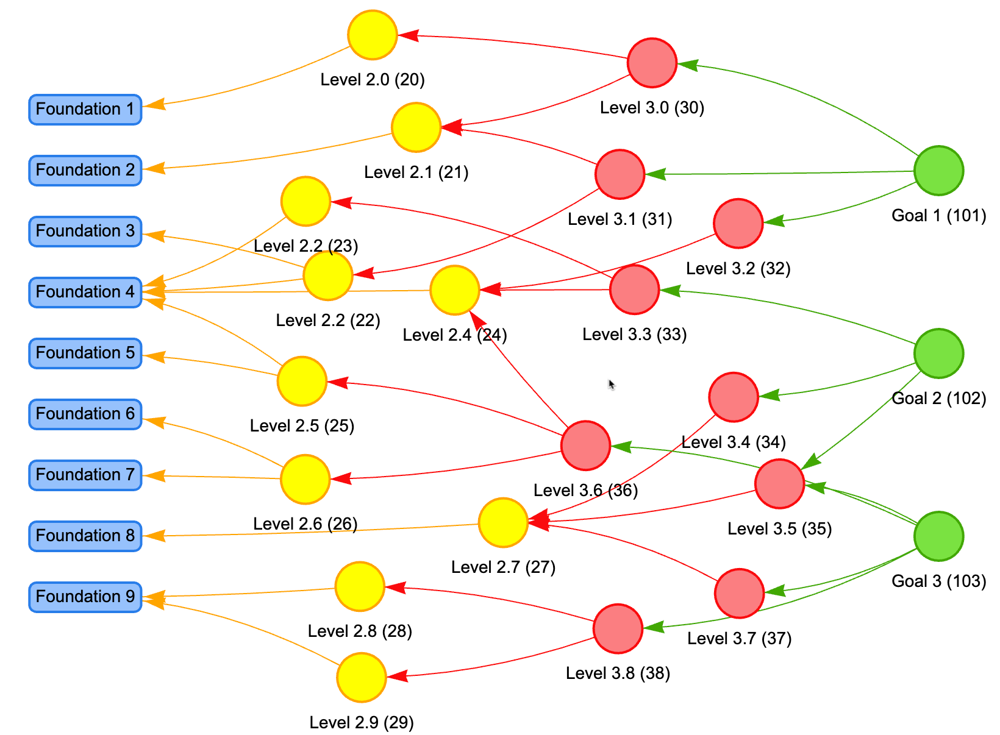

# Concept Dependencies



## Sample Prompt

```linenums="0""Le
I am creating a course on [SUBJECT] in the [DEPARTMENT] at a [COLLAGE].
I have a list of the 150 concepts taught in this course.

Please create a fully connected concept dependency graph
for the concepts in this course.
In this step, for each Concept on this list below, create a new
list of other concepts on which it depends.  If a concept
depends on a specific concept that is not listed,
then we will need to add it as a new concept.
This will help us determine the teaching order of the Concepts.

Return the new list as a CSV file using the following format:

1. The first column in the CSV file is a numeric concept
ID you assigned in the list above.
2. The second column is the concept name.
3. The third column is a pipe-delimited list of the Concept IDs that the concept depends upon.

Check your results to make sure that all concepts are connected to at least one other concept.

Foundation Concepts are concepts that have no dependant concepts in this set.  
They have an empty third column.

Here is a numbered list of 150 core concepts for my course, presented in the order they should be taught, from foundational to advanced:

1,Concept Name 1
2,Concept Name 2