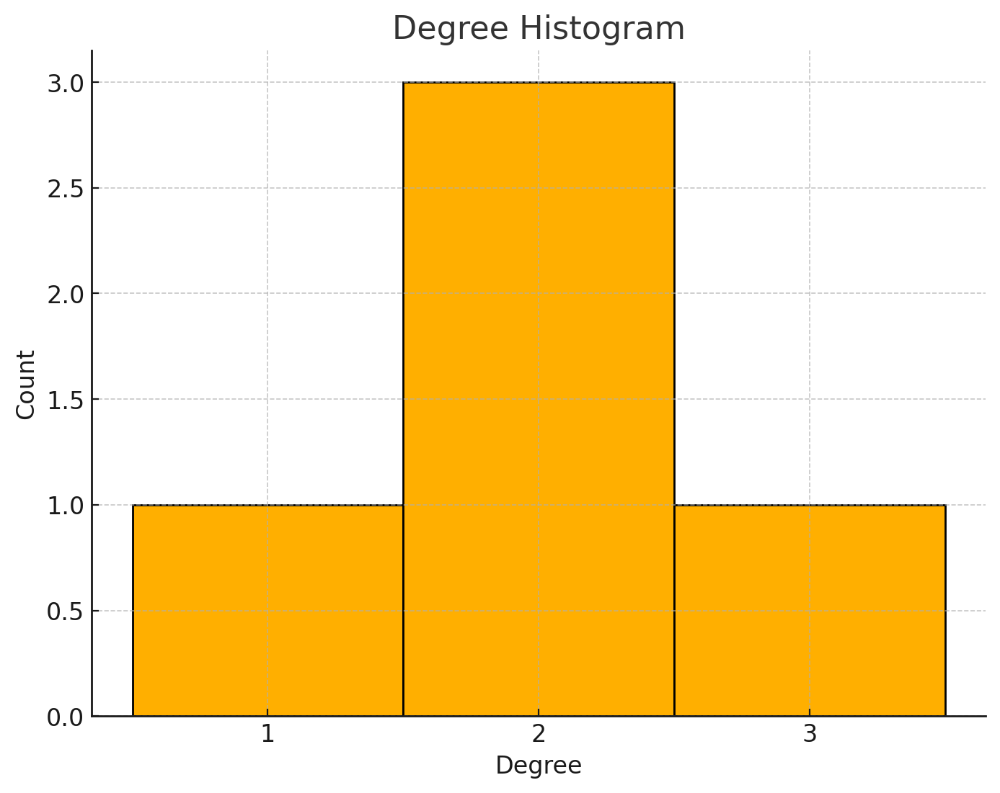
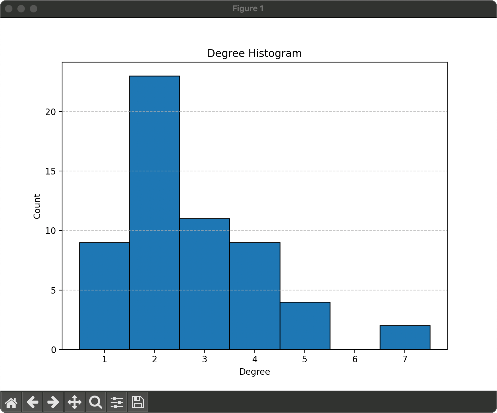

# Degree Histogram

## Prompt

```
Please create a Python program that draws a degree histogram
of a network graph.  The graph data comes in the form of a vis.js
JSON file.  Place "Degree" on the horizontal axis and "Count" on
the vertical axis.  Create a JSON file to test the program.
```

## Response

```python
import json
import matplotlib.pyplot as plt
import networkx as nx

# Create a sample vis.js JSON file for testing
visjs_graph = {
    "nodes": [
        {"id": 1}, {"id": 2}, {"id": 3}, {"id": 4}, {"id": 5}
    ],
    "edges": [
        {"from": 1, "to": 2},
        {"from": 1, "to": 3},
        {"from": 2, "to": 3},
        {"from": 3, "to": 4},
        {"from": 4, "to": 5}
    ]
}

# Save the sample JSON file
json_filename = '/mnt/data/sample_graph.json'
with open(json_filename, 'w') as f:
    json.dump(visjs_graph, f, indent=4)

# Function to load vis.js JSON and create a degree histogram
def draw_degree_histogram(json_file):
    # Load the JSON data
    with open(json_file, 'r') as f:
        data = json.load(f)
    
    # Create a NetworkX graph
    G = nx.Graph()
    for node in data['nodes']:
        G.add_node(node['id'])
    for edge in data['edges']:
        G.add_edge(edge['from'], edge['to'])
    
    # Calculate the degree of each node
    degrees = [degree for _, degree in G.degree()]
    
    # Create the histogram
    plt.figure(figsize=(8, 6))
    plt.hist(degrees, bins=range(min(degrees), max(degrees) + 2), edgecolor='black', align='left')
    plt.title('Degree Histogram')
    plt.xlabel('Degree')
    plt.ylabel('Count')
    plt.xticks(range(min(degrees), max(degrees) + 1))
    plt.grid(axis='y', linestyle='--', alpha=0.7)
    plt.show()

# Test the function with the created JSON file
draw_degree_histogram(json_filename)
```





## Running the Degree Graph

Make sure that you have the right python libraries loaded:

```sh
pip install networkx matplotlib
```

```sh
$ cd src/degree-chart
$ python degree-chart.py MYGRAPH.json
```

Replace MYGRAPH.json with your graph name in vis.js format.