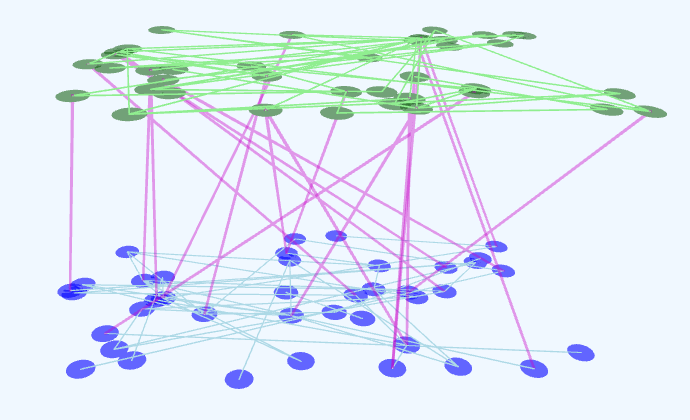

<meta property="og:title" content="Learning Graph Concept to Content Viewer">
<meta property="og:description" content="A MicroSim in p5.js that helps users visualized the parallel plans of Concept graphs and Content graphs.">
<meta property="og:image" content="/learning-graphs/sims/concept-to-content-viewer/concept-to-content-viewer.png">
   

# Concept to Content Viewer

[Run the Concept to Content Viewer MicroSim](concept-to-content-viewer.html){ .md-button .md-button--primary }

Note: you can use your mouse to change the viewpoint and zoom of the animation.

When I think of learning graphs, I really image two parallel planes, each with their own nodes.

The first plane is the **Concept Plane** which has Concept nodes in it.  The edges in the Concept
plane are learning dependencies.  You can't learn some advanced concepts until you learn about
the concepts that they depend on.  This plane is represented by the green network graph in the figure above.

The second plane is a **Content Plane**.  This plane stores a list verticies that reference all the content related to one or 
more Concepts.  Content is often linked to other content through links such as hyptertext links between web pages.
This plane is the blue plane below the green plane in the figure above.

Connecting these two planes are Concept to Content links, drawn in purple links in the figure above.
Note that these are not just one-to-one relationships.  A web page might refernced many Concepts and
a Concept could be explained and used in many pages.

What is important to understand is that concepts and content work together to create recommendations
for learning paths for students.  For example, imagine that a student wants to master a complex concept.
But first they must learn three other Concepts.  Each of these has an order, and the content that they
are connected to would be recommended by a Chatbot or a Learning Agent.

