# MicroSims

This book includes **64 interactive MicroSims** — self-contained, browser-based visualizations you can explore directly. Click any thumbnail to open the MicroSim.

<!-- This gallery is generated by generate-sims-index.py — edits here will be overwritten. -->

  <a href="adaptive-learning-loop-explorer/" title="Adaptive Learning Loop Explorer" style="display:block;border:1px solid #e3e7ec;border-radius:8px;overflow:hidden;text-decoration:none;color:inherit;box-shadow:0 1px 3px rgba(0,0,0,0.08);">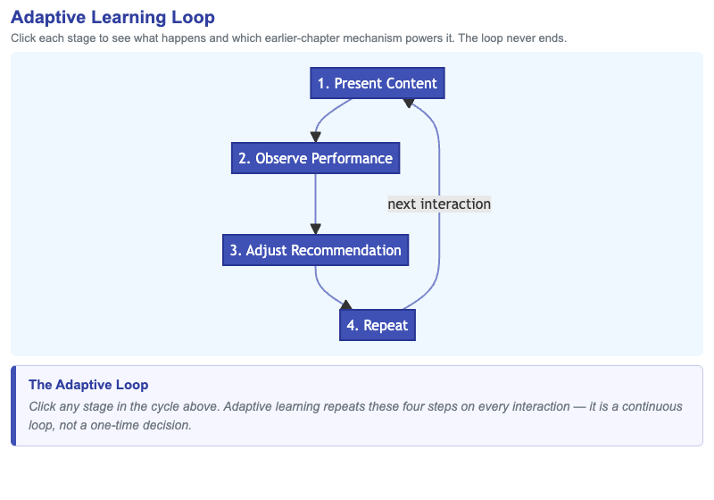Adaptive Learning Loop Explorer</a>
  <a href="agent-capability-explorer/" title="Agent Capability Explorer" style="display:block;border:1px solid #e3e7ec;border-radius:8px;overflow:hidden;text-decoration:none;color:inherit;box-shadow:0 1px 3px rgba(0,0,0,0.08);">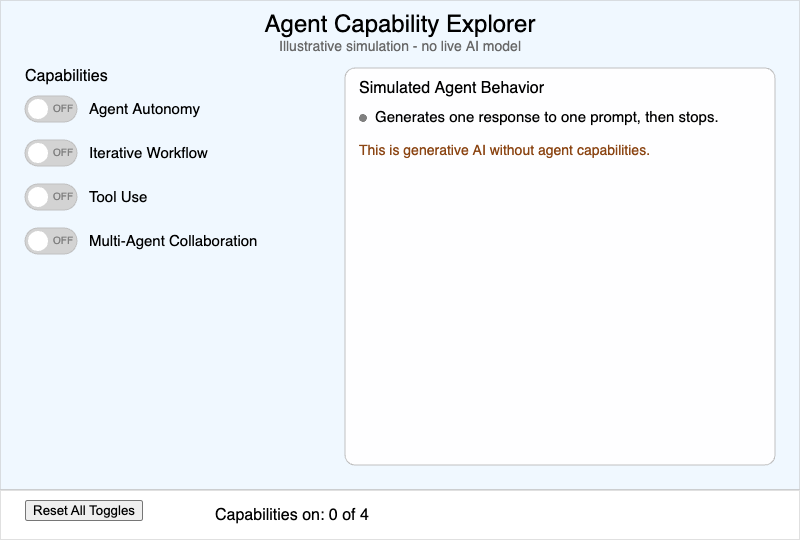Agent Capability Explorer</a>
  <a href="feedback-loop-explorer/" title="Assessment Feedback Loop Explorer" style="display:block;border:1px solid #e3e7ec;border-radius:8px;overflow:hidden;text-decoration:none;color:inherit;box-shadow:0 1px 3px rgba(0,0,0,0.08);">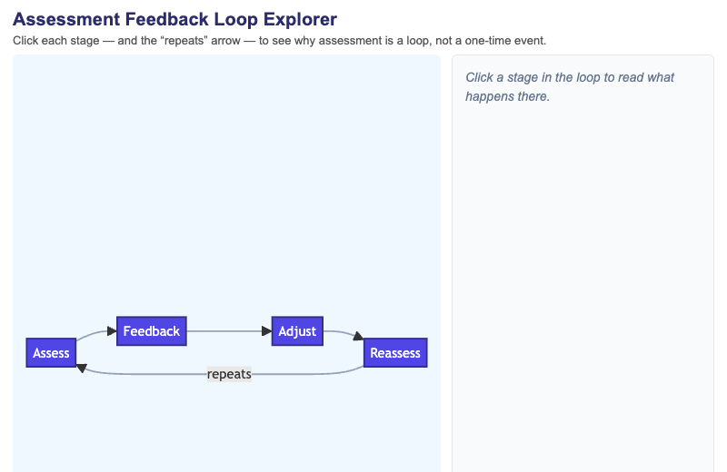Assessment Feedback Loop Explorer</a>
  <a href="blocked-vs-interleaved-simulator/" title="Blocked vs. Interleaved Practice Simulator" style="display:block;border:1px solid #e3e7ec;border-radius:8px;overflow:hidden;text-decoration:none;color:inherit;box-shadow:0 1px 3px rgba(0,0,0,0.08);">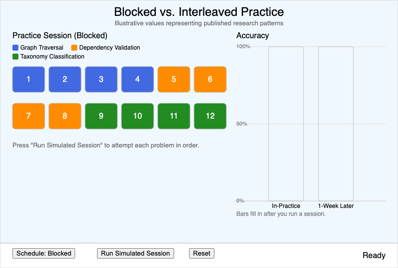Blocked vs. Interleaved Practice Simulator</a>
  <a href="blooms-pyramid-explorer/" title="Bloom&#x27;s Taxonomy Pyramid Explorer" style="display:block;border:1px solid #e3e7ec;border-radius:8px;overflow:hidden;text-decoration:none;color:inherit;box-shadow:0 1px 3px rgba(0,0,0,0.08);">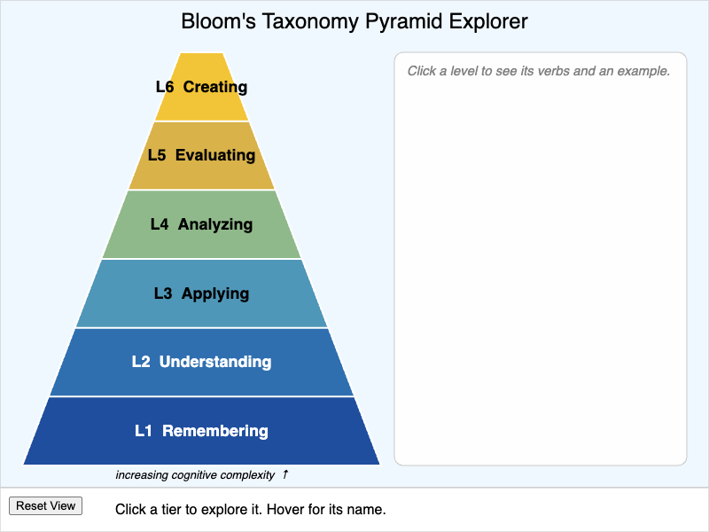Bloom&#x27;s Taxonomy Pyramid Explorer</a>
  <a href="book-chapter-metrics-dashboard/" title="Book and Chapter Metrics Dashboard" style="display:block;border:1px solid #e3e7ec;border-radius:8px;overflow:hidden;text-decoration:none;color:inherit;box-shadow:0 1px 3px rgba(0,0,0,0.08);">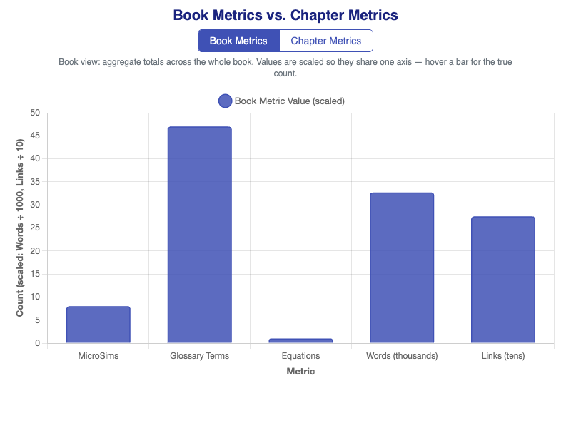Book and Chapter Metrics Dashboard</a>
  <a href="book-build-workflow/" title="Book Build Workflow" style="display:block;border:1px solid #e3e7ec;border-radius:8px;overflow:hidden;text-decoration:none;color:inherit;box-shadow:0 1px 3px rgba(0,0,0,0.08);">no previewBook Build Workflow</a>
  <a href="book-gen-workflow/" title="Book Build Workflow" style="display:block;border:1px solid #e3e7ec;border-radius:8px;overflow:hidden;text-decoration:none;color:inherit;box-shadow:0 1px 3px rgba(0,0,0,0.08);">no previewBook Build Workflow</a>
  <a href="book-build-workflow-pipeline/" title="Book Build Workflow Pipeline" style="display:block;border:1px solid #e3e7ec;border-radius:8px;overflow:hidden;text-decoration:none;color:inherit;box-shadow:0 1px 3px rgba(0,0,0,0.08);">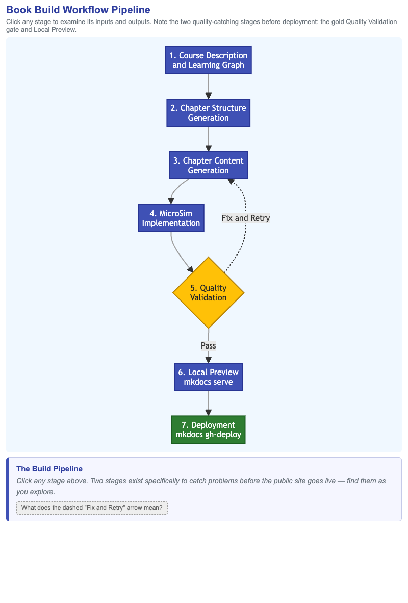Book Build Workflow Pipeline</a>
  <a href="clustering-abstraction-explorer/" title="Clustering and Abstraction Explorer" style="display:block;border:1px solid #e3e7ec;border-radius:8px;overflow:hidden;text-decoration:none;color:inherit;box-shadow:0 1px 3px rgba(0,0,0,0.08);">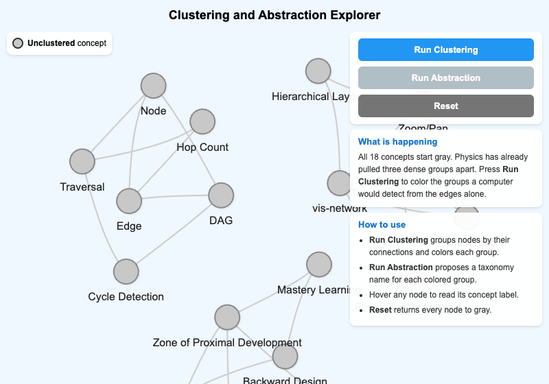Clustering and Abstraction Explorer</a>
  <a href="concept-to-content-viewer/" title="Concept to Content Viewer" style="display:block;border:1px solid #e3e7ec;border-radius:8px;overflow:hidden;text-decoration:none;color:inherit;box-shadow:0 1px 3px rgba(0,0,0,0.08);">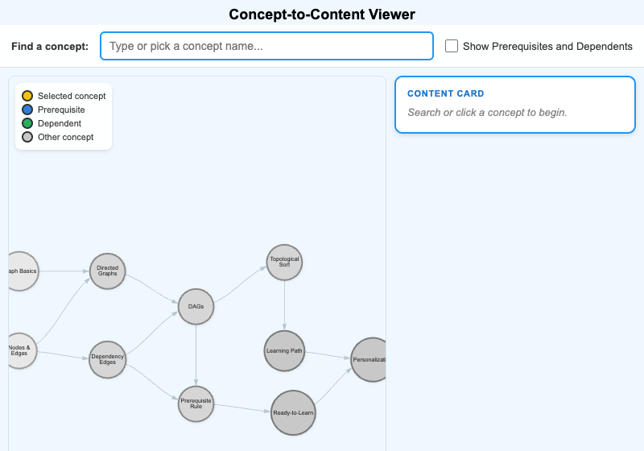Concept to Content Viewer</a>
  <a href="content-sequencing-simulator/" title="Content Sequencing Algorithm Simulator" style="display:block;border:1px solid #e3e7ec;border-radius:8px;overflow:hidden;text-decoration:none;color:inherit;box-shadow:0 1px 3px rgba(0,0,0,0.08);">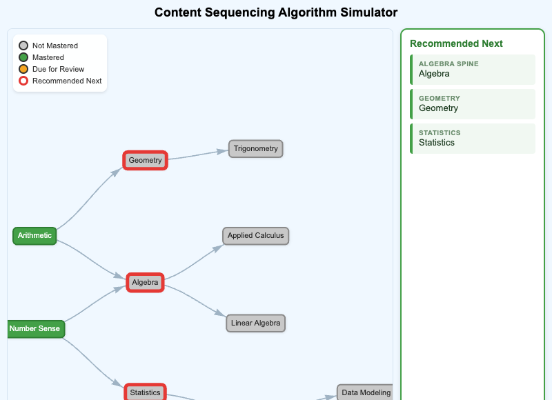Content Sequencing Algorithm Simulator</a>
  <a href="dag-cycle-detector/" title="DAG Cycle Detector" style="display:block;border:1px solid #e3e7ec;border-radius:8px;overflow:hidden;text-decoration:none;color:inherit;box-shadow:0 1px 3px rgba(0,0,0,0.08);">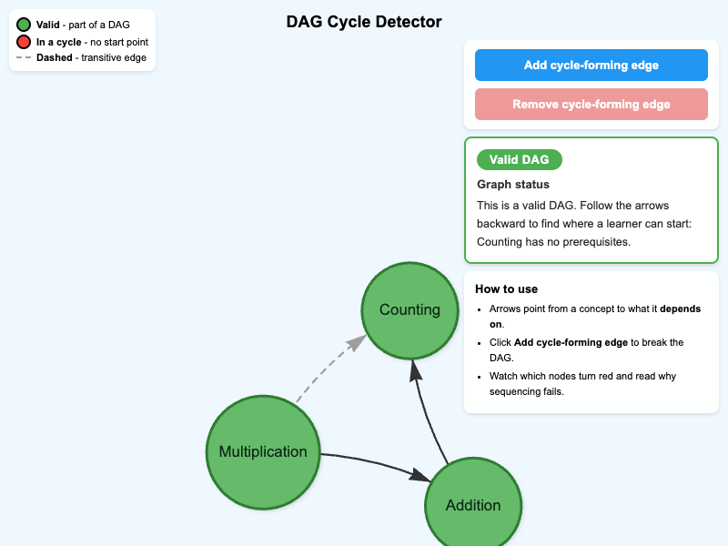DAG Cycle Detector</a>
  <a href="dependency-analysis-console/" title="Dependency Analysis Console" style="display:block;border:1px solid #e3e7ec;border-radius:8px;overflow:hidden;text-decoration:none;color:inherit;box-shadow:0 1px 3px rgba(0,0,0,0.08);">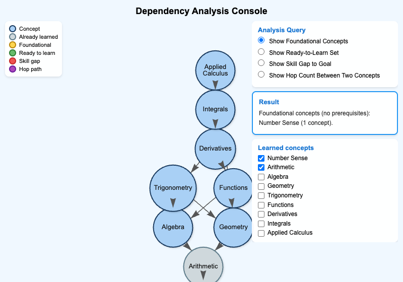Dependency Analysis Console</a>
  <a href="dependency-role-explorer/" title="Dependency Role Explorer" style="display:block;border:1px solid #e3e7ec;border-radius:8px;overflow:hidden;text-decoration:none;color:inherit;box-shadow:0 1px 3px rgba(0,0,0,0.08);">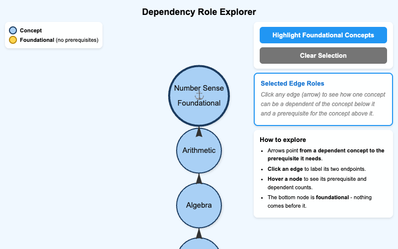Dependency Role Explorer</a>
  <a href="distractor-quality-rater/" title="Distractor Quality Rater" style="display:block;border:1px solid #e3e7ec;border-radius:8px;overflow:hidden;text-decoration:none;color:inherit;box-shadow:0 1px 3px rgba(0,0,0,0.08);">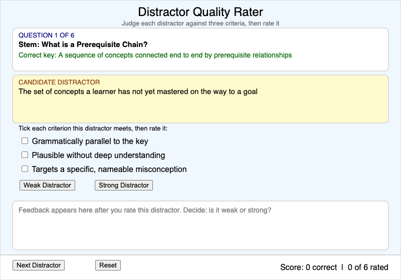Distractor Quality Rater</a>
  <a href="domain-cluster-explorer/" title="Domain Cluster Explorer" style="display:block;border:1px solid #e3e7ec;border-radius:8px;overflow:hidden;text-decoration:none;color:inherit;box-shadow:0 1px 3px rgba(0,0,0,0.08);">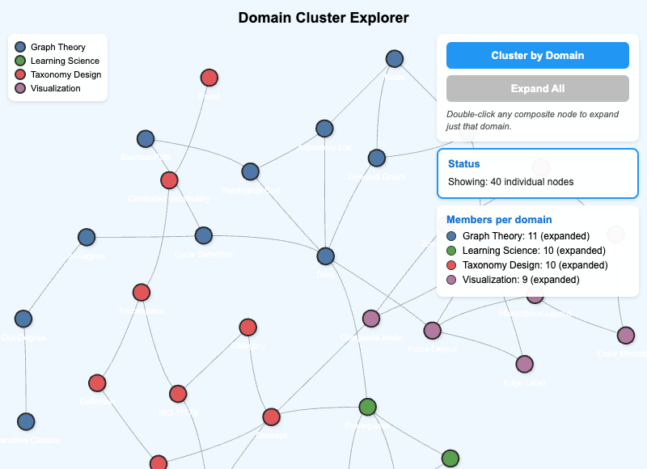Domain Cluster Explorer</a>
  <a href="dublin-core-metadata-explorer/" title="Dublin Core Metadata Explorer" style="display:block;border:1px solid #e3e7ec;border-radius:8px;overflow:hidden;text-decoration:none;color:inherit;box-shadow:0 1px 3px rgba(0,0,0,0.08);">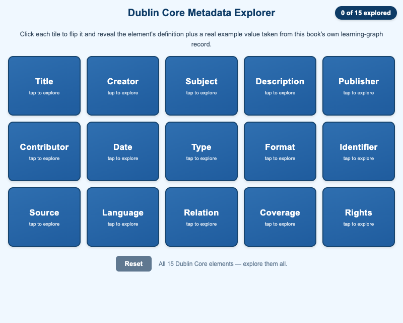Dublin Core Metadata Explorer</a>
  <a href="edge-smoothing-curve-explorer/" title="Edge Smoothing and Curve Type Explorer" style="display:block;border:1px solid #e3e7ec;border-radius:8px;overflow:hidden;text-decoration:none;color:inherit;box-shadow:0 1px 3px rgba(0,0,0,0.08);">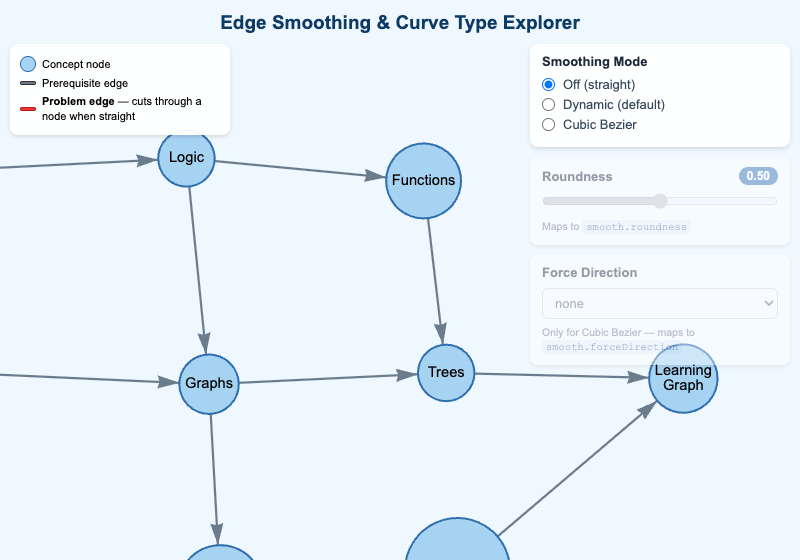Edge Smoothing and Curve Type Explorer</a>
  <a href="edge-styling-property-playground/" title="Edge Styling Property Playground" style="display:block;border:1px solid #e3e7ec;border-radius:8px;overflow:hidden;text-decoration:none;color:inherit;box-shadow:0 1px 3px rgba(0,0,0,0.08);">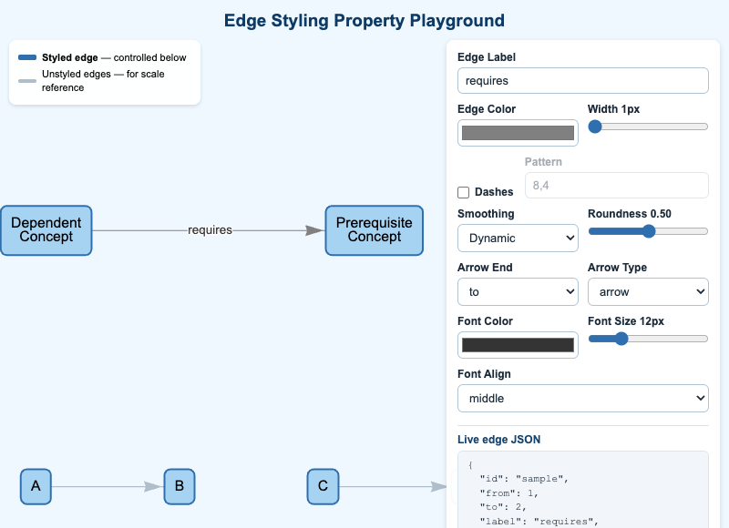Edge Styling Property Playground</a>
  <a href="force-directed-layout-explorer/" title="Force-Directed Layout Explorer" style="display:block;border:1px solid #e3e7ec;border-radius:8px;overflow:hidden;text-decoration:none;color:inherit;box-shadow:0 1px 3px rgba(0,0,0,0.08);">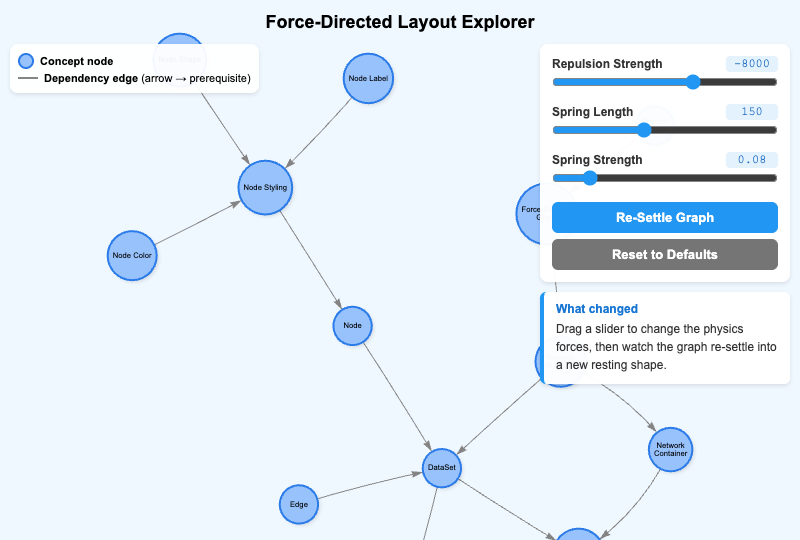Force-Directed Layout Explorer</a>
  <a href="concept-to-index-workflow/" title="From Concept to Index Entry" style="display:block;border:1px solid #e3e7ec;border-radius:8px;overflow:hidden;text-decoration:none;color:inherit;box-shadow:0 1px 3px rgba(0,0,0,0.08);">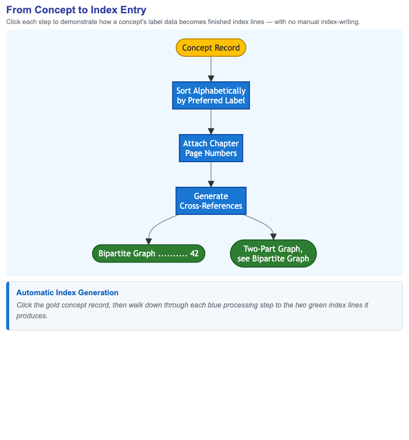From Concept to Index Entry</a>
  <a href="genai-learning-graph-pipeline/" title="Generative AI to Learning Graph Pipeline" style="display:block;border:1px solid #e3e7ec;border-radius:8px;overflow:hidden;text-decoration:none;color:inherit;box-shadow:0 1px 3px rgba(0,0,0,0.08);">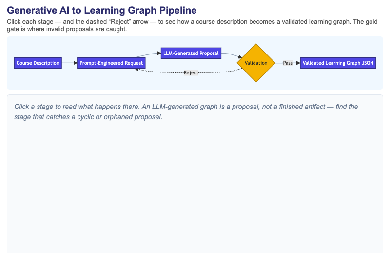Generative AI to Learning Graph Pipeline</a>
  <a href="goal-horizon-timeline/" title="Goal Horizon Timeline" style="display:block;border:1px solid #e3e7ec;border-radius:8px;overflow:hidden;text-decoration:none;color:inherit;box-shadow:0 1px 3px rgba(0,0,0,0.08);">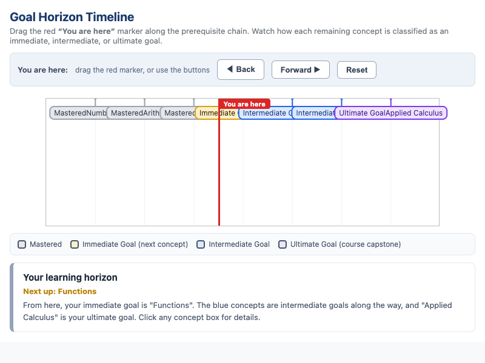Goal Horizon Timeline</a>
  <a href="graph-anatomy-explorer/" title="Graph Anatomy Explorer" style="display:block;border:1px solid #e3e7ec;border-radius:8px;overflow:hidden;text-decoration:none;color:inherit;box-shadow:0 1px 3px rgba(0,0,0,0.08);">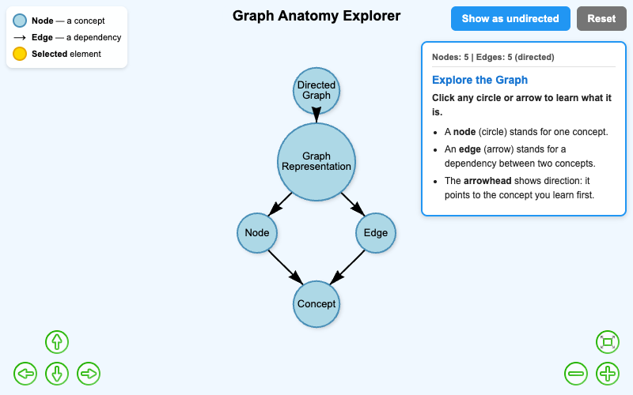Graph Anatomy Explorer</a>
  <a href="graph-editor-live-validation/" title="Graph Editor with Live Validation" style="display:block;border:1px solid #e3e7ec;border-radius:8px;overflow:hidden;text-decoration:none;color:inherit;box-shadow:0 1px 3px rgba(0,0,0,0.08);">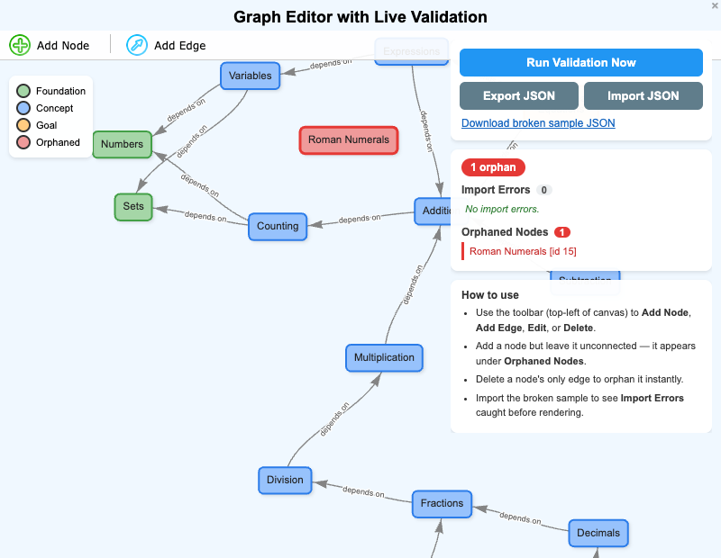Graph Editor with Live Validation</a>
  <a href="graph-family-lens-explorer/" title="Graph Family Lens Explorer" style="display:block;border:1px solid #e3e7ec;border-radius:8px;overflow:hidden;text-decoration:none;color:inherit;box-shadow:0 1px 3px rgba(0,0,0,0.08);">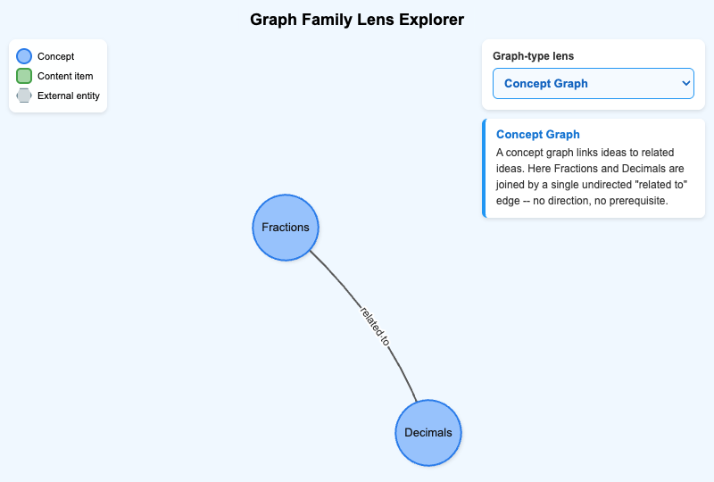Graph Family Lens Explorer</a>
  <a href="learning-graph/" title="Graph Viewer" style="display:block;border:1px solid #e3e7ec;border-radius:8px;overflow:hidden;text-decoration:none;color:inherit;box-shadow:0 1px 3px rgba(0,0,0,0.08);">no previewGraph Viewer</a>
  <a href="hover-tooltip-explorer/" title="Hover Tooltip Explorer" style="display:block;border:1px solid #e3e7ec;border-radius:8px;overflow:hidden;text-decoration:none;color:inherit;box-shadow:0 1px 3px rgba(0,0,0,0.08);">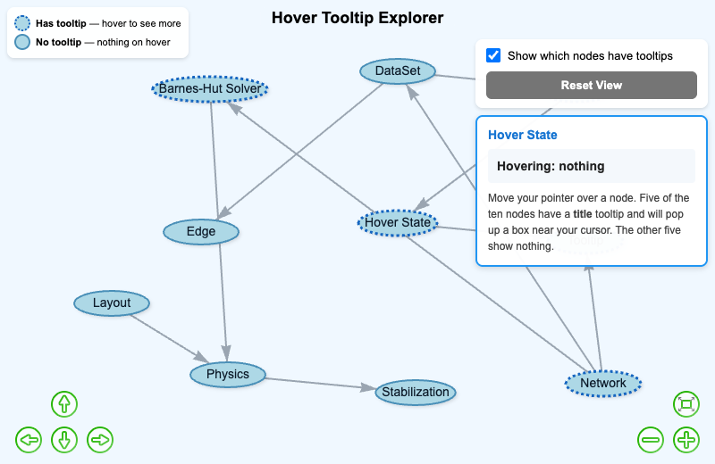Hover Tooltip Explorer</a>
  <a href="hyper-personalization-input-explorer/" title="Hyper-Personalization Input Explorer" style="display:block;border:1px solid #e3e7ec;border-radius:8px;overflow:hidden;text-decoration:none;color:inherit;box-shadow:0 1px 3px rgba(0,0,0,0.08);">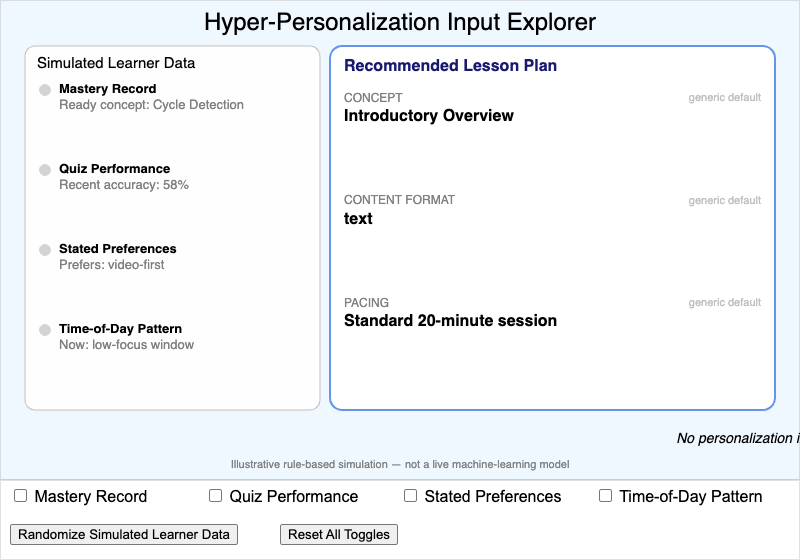Hyper-Personalization Input Explorer</a>
  <a href="indegree-outdegree-counter/" title="Indegree and Out-Degree Counter" style="display:block;border:1px solid #e3e7ec;border-radius:8px;overflow:hidden;text-decoration:none;color:inherit;box-shadow:0 1px 3px rgba(0,0,0,0.08);">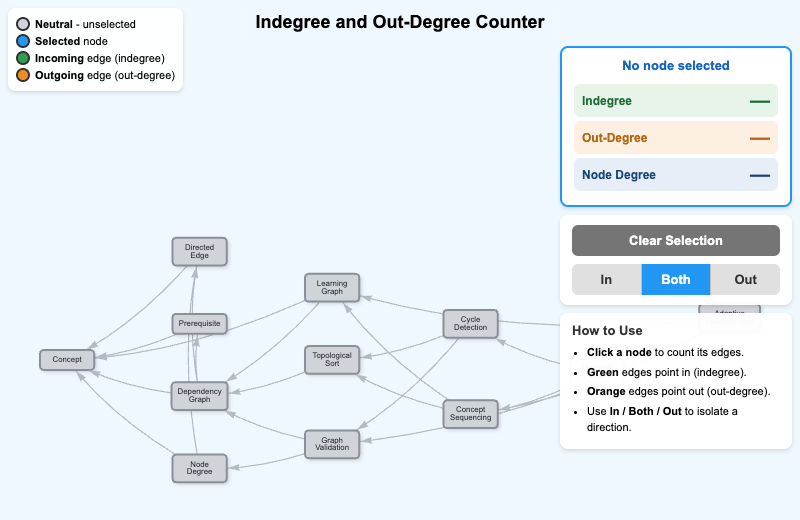Indegree and Out-Degree Counter</a>
  <a href="interactive-legend-filter/" title="Interactive Legend Filter" style="display:block;border:1px solid #e3e7ec;border-radius:8px;overflow:hidden;text-decoration:none;color:inherit;box-shadow:0 1px 3px rgba(0,0,0,0.08);">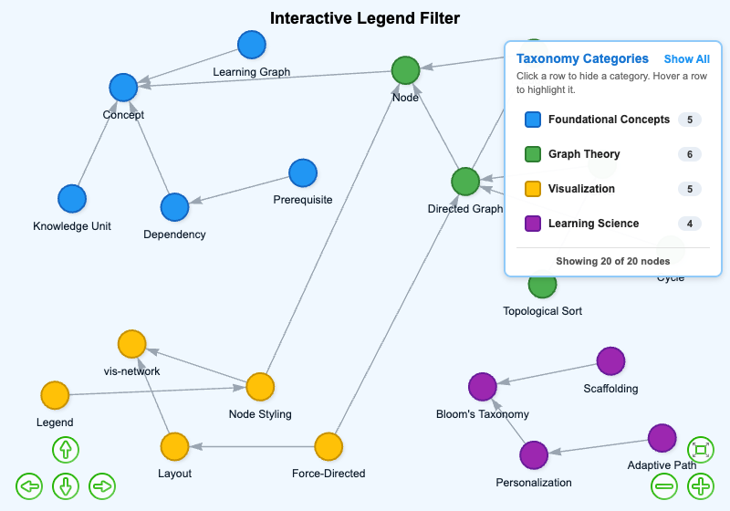Interactive Legend Filter</a>
  <a href="interactive-taxonomy-legend/" title="Interactive Taxonomy Legend and Filter" style="display:block;border:1px solid #e3e7ec;border-radius:8px;overflow:hidden;text-decoration:none;color:inherit;box-shadow:0 1px 3px rgba(0,0,0,0.08);">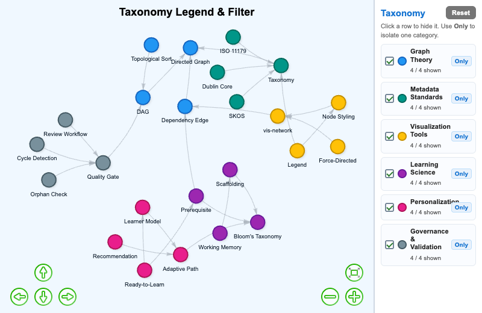Interactive Taxonomy Legend and Filter</a>
  <a href="journey-map-builder/" title="Journey Map Builder" style="display:block;border:1px solid #e3e7ec;border-radius:8px;overflow:hidden;text-decoration:none;color:inherit;box-shadow:0 1px 3px rgba(0,0,0,0.08);">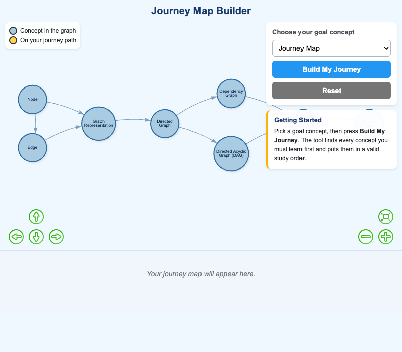Journey Map Builder</a>
  <a href="knowledge-space-explorer/" title="Knowledge Space Explorer" style="display:block;border:1px solid #e3e7ec;border-radius:8px;overflow:hidden;text-decoration:none;color:inherit;box-shadow:0 1px 3px rgba(0,0,0,0.08);">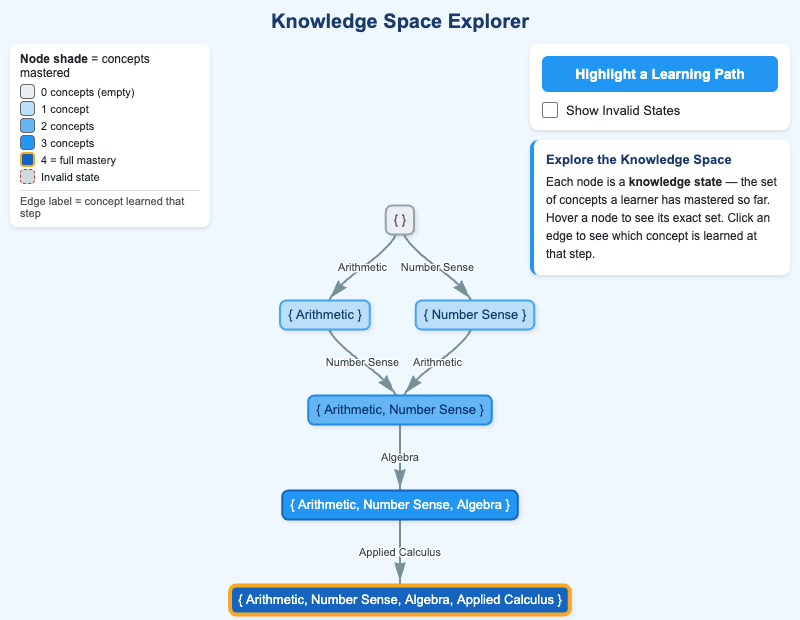Knowledge Space Explorer</a>
  <a href="label-anatomy-explorer/" title="Label Anatomy Explorer" style="display:block;border:1px solid #e3e7ec;border-radius:8px;overflow:hidden;text-decoration:none;color:inherit;box-shadow:0 1px 3px rgba(0,0,0,0.08);">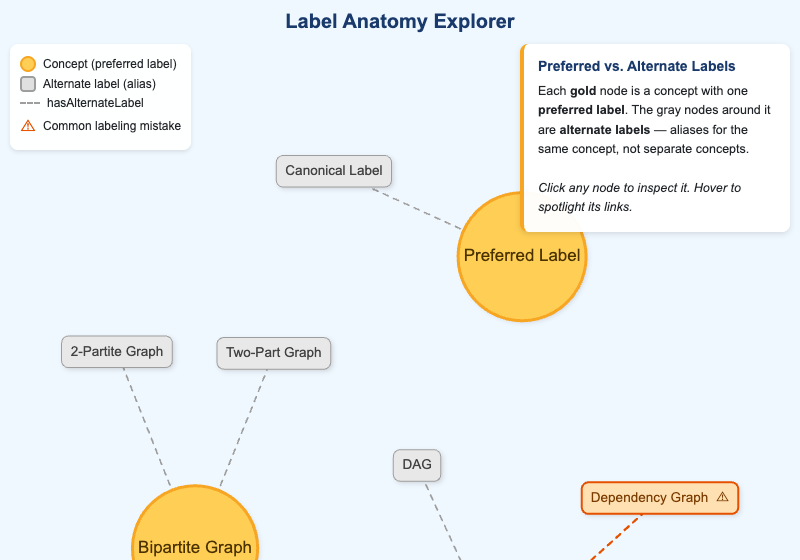Label Anatomy Explorer</a>
  <a href="layout-algorithm-comparison-lab/" title="Layout Algorithm Comparison Lab" style="display:block;border:1px solid #e3e7ec;border-radius:8px;overflow:hidden;text-decoration:none;color:inherit;box-shadow:0 1px 3px rgba(0,0,0,0.08);">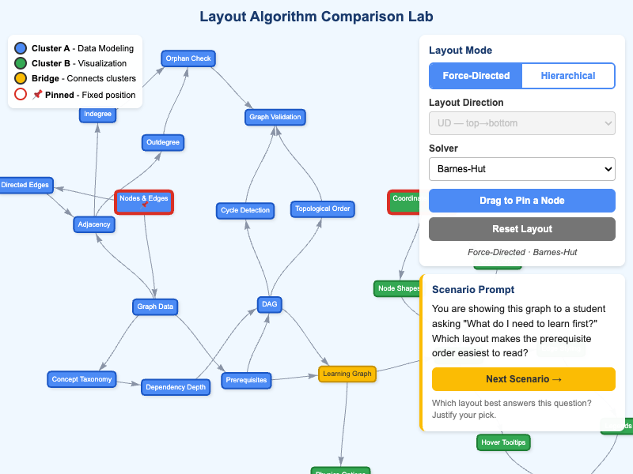Layout Algorithm Comparison Lab</a>
  <a href="learning-graph-quality-gate-explorer/" title="Learning Graph Quality Gate Explorer" style="display:block;border:1px solid #e3e7ec;border-radius:8px;overflow:hidden;text-decoration:none;color:inherit;box-shadow:0 1px 3px rgba(0,0,0,0.08);">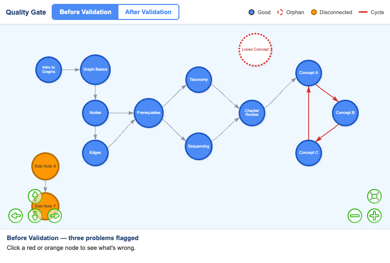Learning Graph Quality Gate Explorer</a>
  <a href="graph-viewer/" title="Learning Graph Viewer" style="display:block;border:1px solid #e3e7ec;border-radius:8px;overflow:hidden;text-decoration:none;color:inherit;box-shadow:0 1px 3px rgba(0,0,0,0.08);">no previewLearning Graph Viewer</a>
  <a href="learning-is-nonlinear/" title="Learning is Nonlinear" style="display:block;border:1px solid #e3e7ec;border-radius:8px;overflow:hidden;text-decoration:none;color:inherit;box-shadow:0 1px 3px rgba(0,0,0,0.08);">no previewLearning is Nonlinear</a>
  <a href="learning-objective-builder/" title="Learning Objective Builder" style="display:block;border:1px solid #e3e7ec;border-radius:8px;overflow:hidden;text-decoration:none;color:inherit;box-shadow:0 1px 3px rgba(0,0,0,0.08);">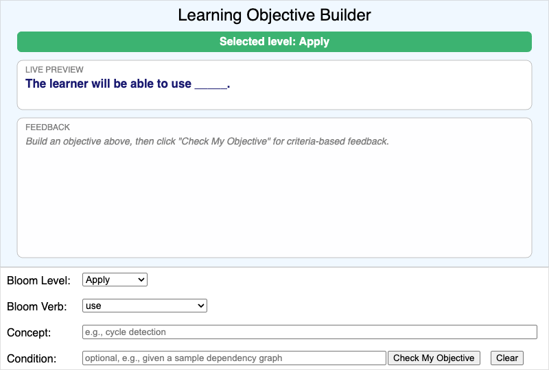Learning Objective Builder</a>
  <a href="rhizombic-path-explorer/" title="Linear Path vs. Rhizombic Exploration" style="display:block;border:1px solid #e3e7ec;border-radius:8px;overflow:hidden;text-decoration:none;color:inherit;box-shadow:0 1px 3px rgba(0,0,0,0.08);">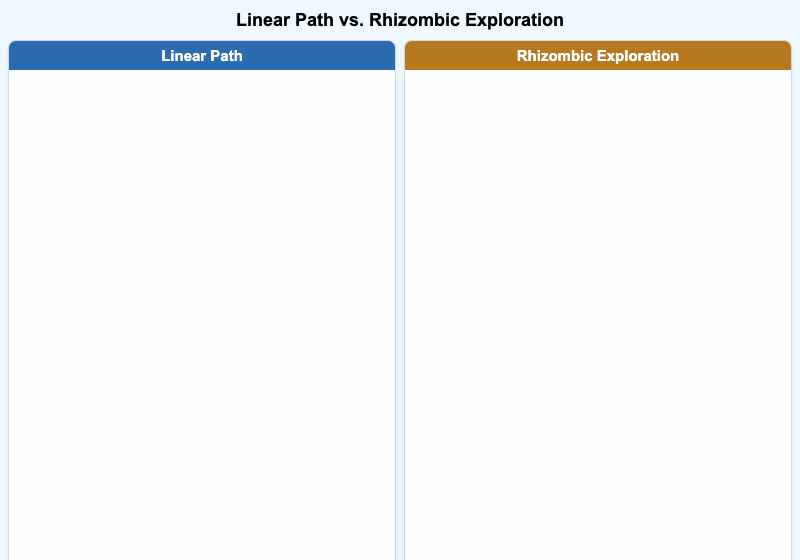Linear Path vs. Rhizombic Exploration</a>
  <a href="microsim-directory-anatomy/" title="MicroSim Directory Anatomy" style="display:block;border:1px solid #e3e7ec;border-radius:8px;overflow:hidden;text-decoration:none;color:inherit;box-shadow:0 1px 3px rgba(0,0,0,0.08);">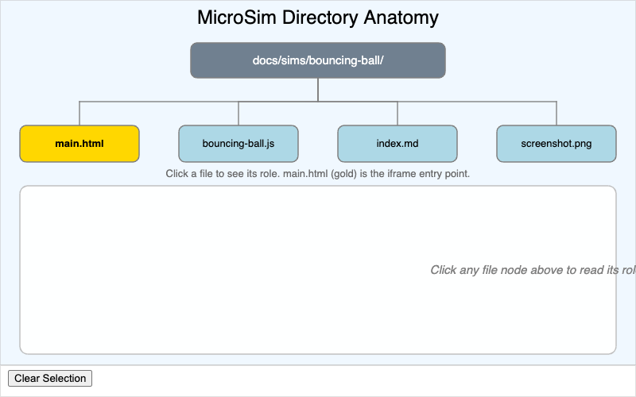MicroSim Directory Anatomy</a>
  <a href="blooms-taxonomy/" title="MicroSim Folder index.md Template" style="display:block;border:1px solid #e3e7ec;border-radius:8px;overflow:hidden;text-decoration:none;color:inherit;box-shadow:0 1px 3px rgba(0,0,0,0.08);">no previewMicroSim Folder index.md Template</a>
  <a href="template/" title="MicroSim Folder index.md Template" style="display:block;border:1px solid #e3e7ec;border-radius:8px;overflow:hidden;text-decoration:none;color:inherit;box-shadow:0 1px 3px rgba(0,0,0,0.08);">no previewMicroSim Folder index.md Template</a>
  <a href="quiz-format-comparison-chart/" title="Multiple-Choice vs. True/False Comparison Chart" style="display:block;border:1px solid #e3e7ec;border-radius:8px;overflow:hidden;text-decoration:none;color:inherit;box-shadow:0 1px 3px rgba(0,0,0,0.08);">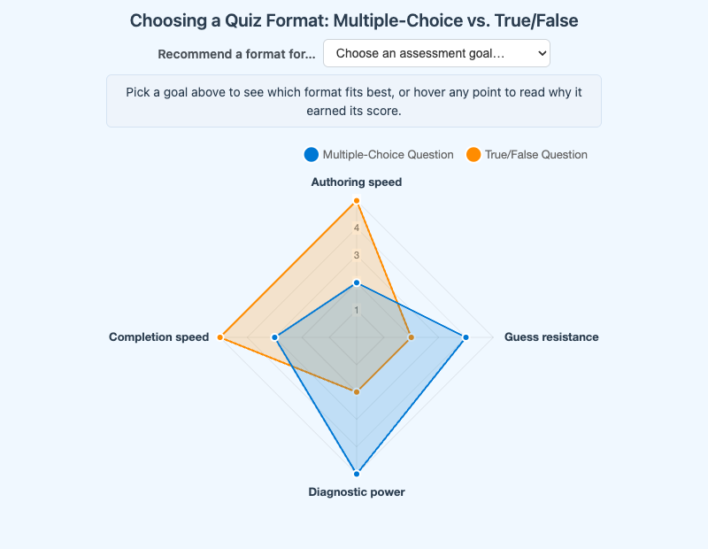Multiple-Choice vs. True/False Comparison Chart</a>
  <a href="nine-events-explorer/" title="Nine Events of Instruction Explorer" style="display:block;border:1px solid #e3e7ec;border-radius:8px;overflow:hidden;text-decoration:none;color:inherit;box-shadow:0 1px 3px rgba(0,0,0,0.08);">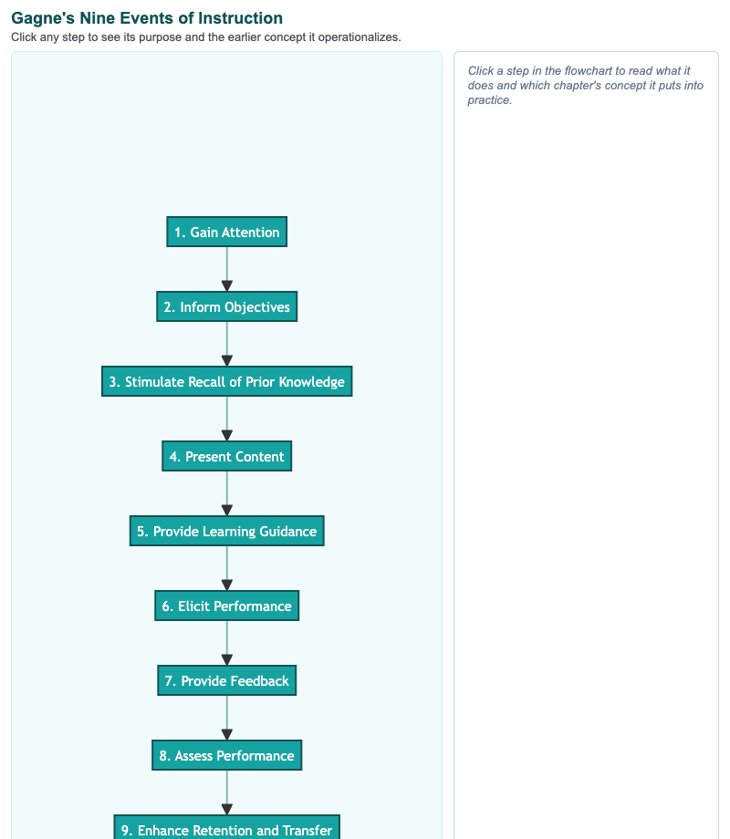Nine Events of Instruction Explorer</a>
  <a href="node-styling-property-playground/" title="Node Styling Property Playground" style="display:block;border:1px solid #e3e7ec;border-radius:8px;overflow:hidden;text-decoration:none;color:inherit;box-shadow:0 1px 3px rgba(0,0,0,0.08);">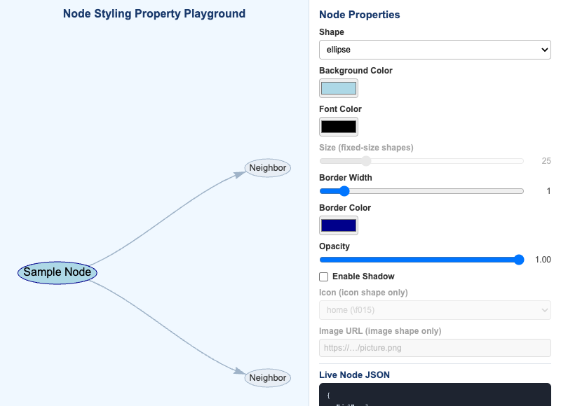Node Styling Property Playground</a>
  <a href="orphan-disconnected-explorer/" title="Orphan and Disconnected Subgraph Explorer" style="display:block;border:1px solid #e3e7ec;border-radius:8px;overflow:hidden;text-decoration:none;color:inherit;box-shadow:0 1px 3px rgba(0,0,0,0.08);">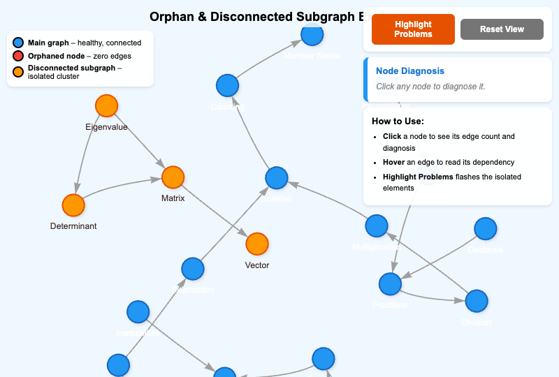Orphan and Disconnected Subgraph Explorer</a>
  <a href="physics-force-explorer/" title="Physics Force Explorer" style="display:block;border:1px solid #e3e7ec;border-radius:8px;overflow:hidden;text-decoration:none;color:inherit;box-shadow:0 1px 3px rgba(0,0,0,0.08);">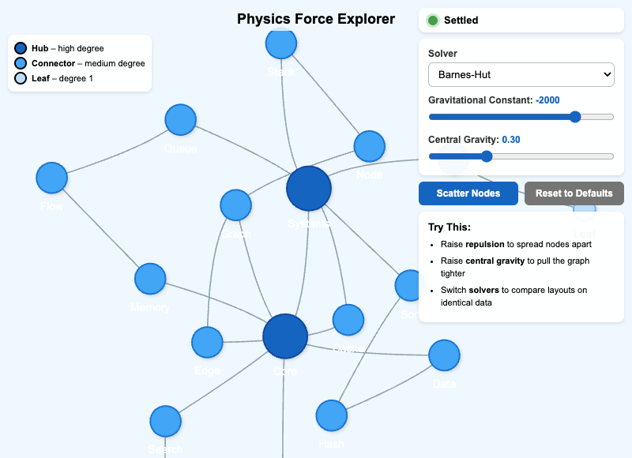Physics Force Explorer</a>
  <a href="ready-to-learn-frontier-simulator/" title="Ready-to-Learn Frontier Simulator" style="display:block;border:1px solid #e3e7ec;border-radius:8px;overflow:hidden;text-decoration:none;color:inherit;box-shadow:0 1px 3px rgba(0,0,0,0.08);">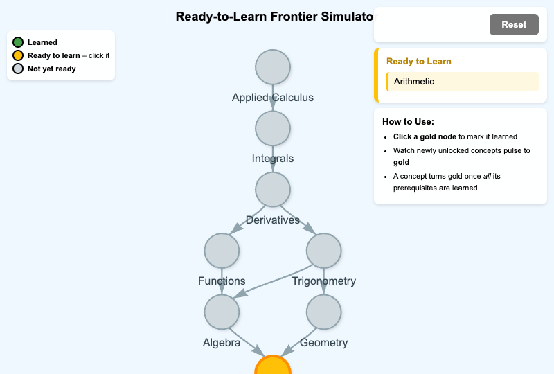Ready-to-Learn Frontier Simulator</a>
  <a href="real-world-deployment-patterns/" title="Real-World Deployment Patterns Explorer" style="display:block;border:1px solid #e3e7ec;border-radius:8px;overflow:hidden;text-decoration:none;color:inherit;box-shadow:0 1px 3px rgba(0,0,0,0.08);">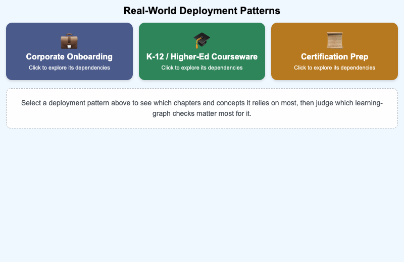Real-World Deployment Patterns Explorer</a>
  <a href="rag-step-through/" title="Retrieval-Augmented Generation Step-Through" style="display:block;border:1px solid #e3e7ec;border-radius:8px;overflow:hidden;text-decoration:none;color:inherit;box-shadow:0 1px 3px rgba(0,0,0,0.08);">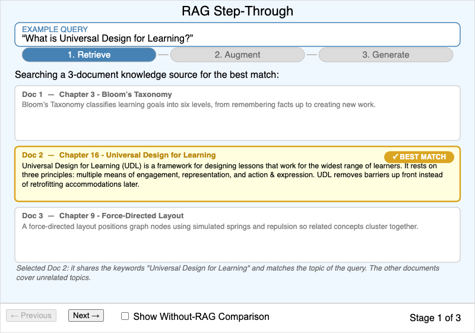Retrieval-Augmented Generation Step-Through</a>
  <a href="scaffolding-fade-simulator/" title="Scaffolding Fade Simulator" style="display:block;border:1px solid #e3e7ec;border-radius:8px;overflow:hidden;text-decoration:none;color:inherit;box-shadow:0 1px 3px rgba(0,0,0,0.08);">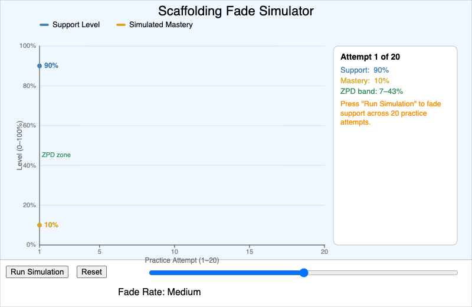Scaffolding Fade Simulator</a>
  <a href="search-focus-navigation-console/" title="Search and Focus Navigation Console" style="display:block;border:1px solid #e3e7ec;border-radius:8px;overflow:hidden;text-decoration:none;color:inherit;box-shadow:0 1px 3px rgba(0,0,0,0.08);">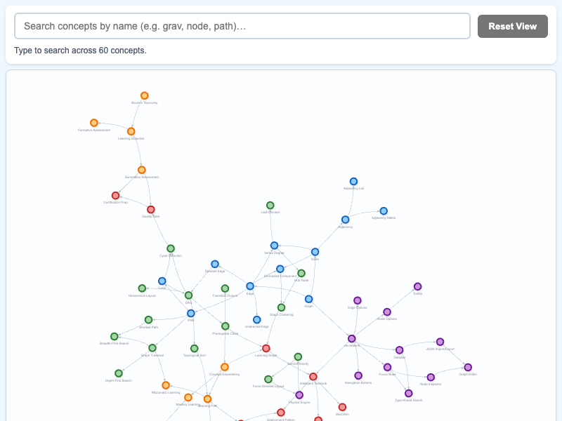Search and Focus Navigation Console</a>
  <a href="similarity-metric-comparison-tool/" title="Similarity Metric Comparison Tool" style="display:block;border:1px solid #e3e7ec;border-radius:8px;overflow:hidden;text-decoration:none;color:inherit;box-shadow:0 1px 3px rgba(0,0,0,0.08);">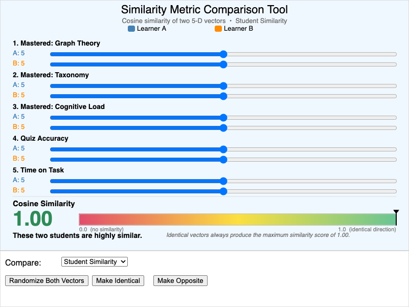Similarity Metric Comparison Tool</a>
  <a href="skos-relationship-map/" title="SKOS Relationship Map" style="display:block;border:1px solid #e3e7ec;border-radius:8px;overflow:hidden;text-decoration:none;color:inherit;box-shadow:0 1px 3px rgba(0,0,0,0.08);">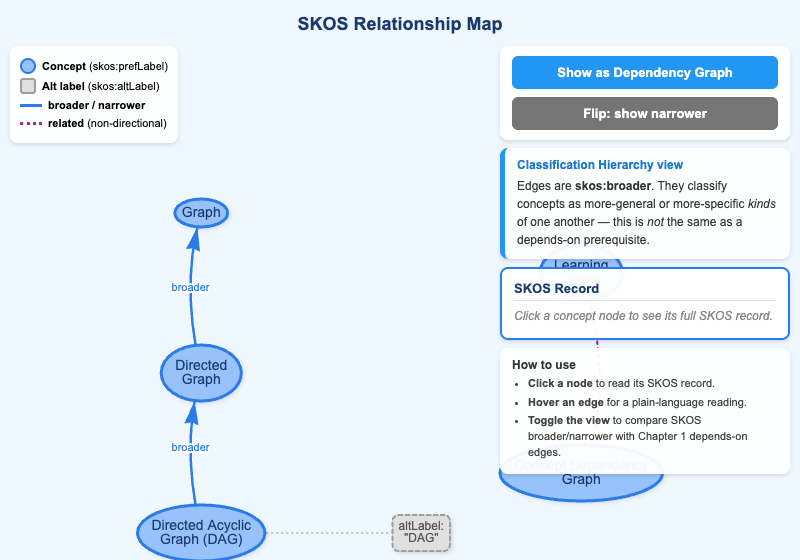SKOS Relationship Map</a>
  <a href="structural-variations-explorer/" title="Structural Variations Explorer" style="display:block;border:1px solid #e3e7ec;border-radius:8px;overflow:hidden;text-decoration:none;color:inherit;box-shadow:0 1px 3px rgba(0,0,0,0.08);">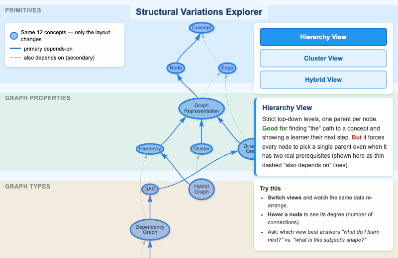Structural Variations Explorer</a>
  <a href="taxonomy-classifier-workbench/" title="Taxonomy Classifier Workbench" style="display:block;border:1px solid #e3e7ec;border-radius:8px;overflow:hidden;text-decoration:none;color:inherit;box-shadow:0 1px 3px rgba(0,0,0,0.08);">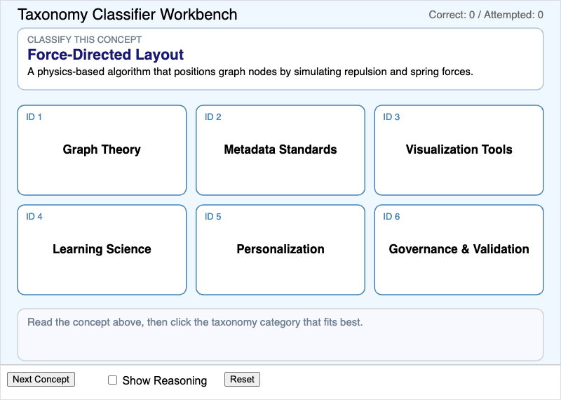Taxonomy Classifier Workbench</a>
  <a href="learning-graph-pipeline-workflow/" title="The Twelve-Step Pipeline From Course Description to Validated Graph" style="display:block;border:1px solid #e3e7ec;border-radius:8px;overflow:hidden;text-decoration:none;color:inherit;box-shadow:0 1px 3px rgba(0,0,0,0.08);">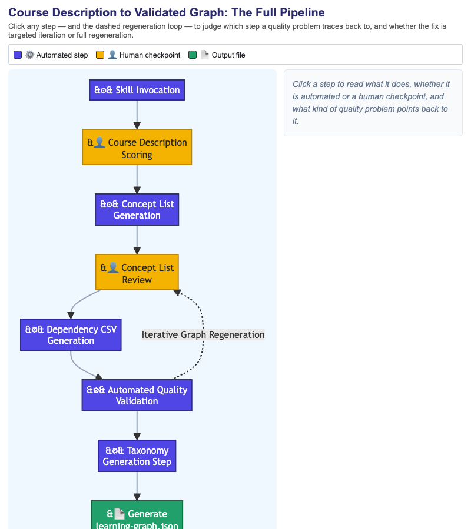The Twelve-Step Pipeline From Course Description to Validated Graph</a>
  <a href="theory-to-practice-map/" title="Theory-to-Practice Concept Map" style="display:block;border:1px solid #e3e7ec;border-radius:8px;overflow:hidden;text-decoration:none;color:inherit;box-shadow:0 1px 3px rgba(0,0,0,0.08);">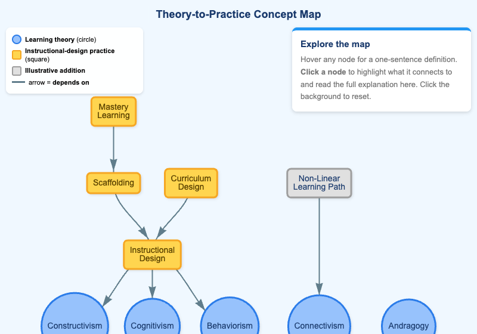Theory-to-Practice Concept Map</a>
  <a href="topological-sort-stepper/" title="Topological Sort Step-Through" style="display:block;border:1px solid #e3e7ec;border-radius:8px;overflow:hidden;text-decoration:none;color:inherit;box-shadow:0 1px 3px rgba(0,0,0,0.08);">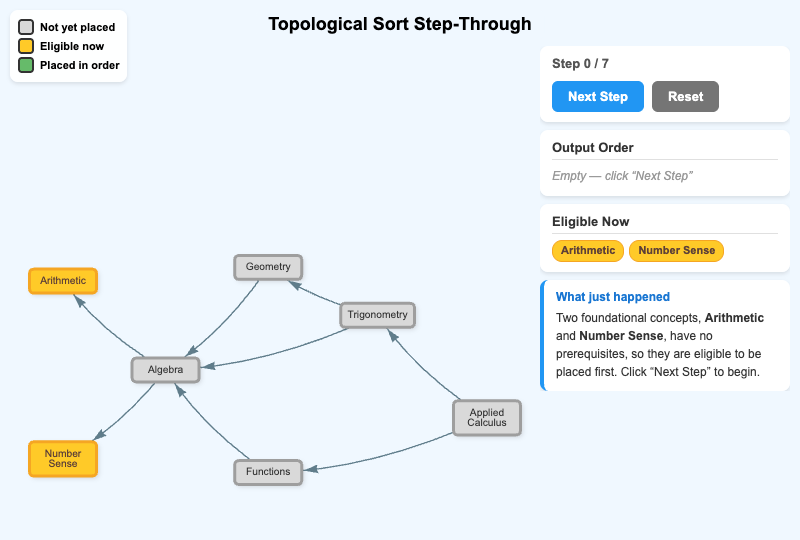Topological Sort Step-Through</a>
  <a href="transitive-dependency-hop-finder/" title="Transitive Dependency and Hop Count Finder" style="display:block;border:1px solid #e3e7ec;border-radius:8px;overflow:hidden;text-decoration:none;color:inherit;box-shadow:0 1px 3px rgba(0,0,0,0.08);">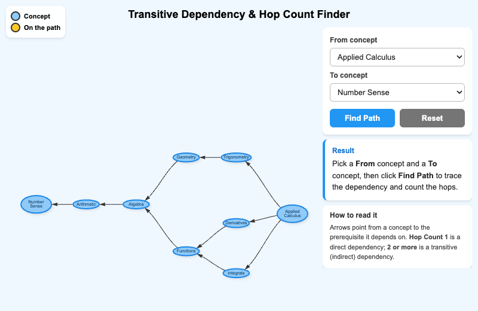Transitive Dependency and Hop Count Finder</a>
  <a href="working-memory-load-simulator/" title="Working Memory Load Simulator" style="display:block;border:1px solid #e3e7ec;border-radius:8px;overflow:hidden;text-decoration:none;color:inherit;box-shadow:0 1px 3px rgba(0,0,0,0.08);">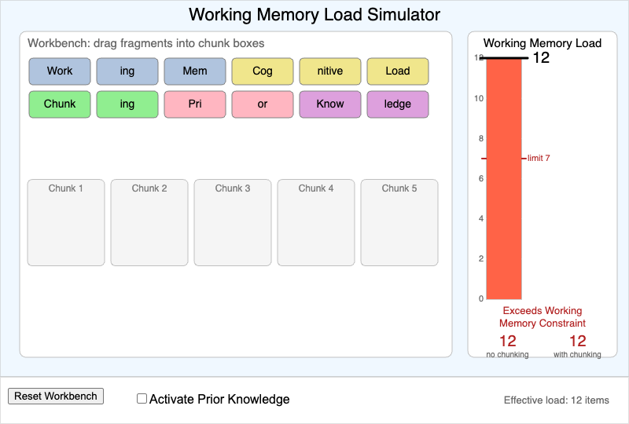Working Memory Load Simulator</a>

