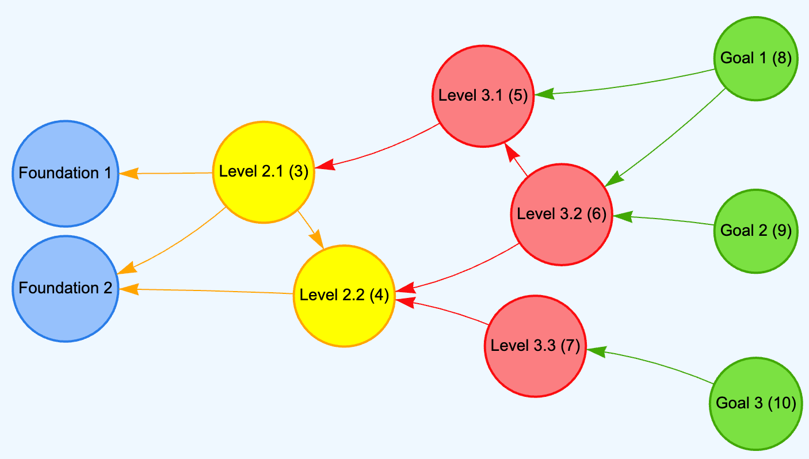

# Fix the X Positions



[Fix X Positions Demo](./fix-x-positions.html)


## Prompt

```
using vis.js, is there a way to freeze a node's x position
but let the y position float freely and be repositioned
by the force-directed graph algorithm?
```

## ChatGPT said:

In **vis.js**, the built-in options for node positioning allow you to fix both the **x** and **y** coordinates of a node using the `fixed` option. However, freezing only one axis while letting the other float (like freezing the x-axis and letting the y-axis adjust with the force-directed graph algorithm) is not supported natively.

That said, you can achieve this behavior with a workaround by using the `physics` option and manually adjusting the node's x position in each frame:

1.  Set the node's `x` position and use the `fixed: { x: true, y: false }` option to lock only the x-axis.
2.  During the graph's update cycle, reapply the node's fixed x position while letting the force algorithm adjust the y position.

Here's an example code snippet to implement this behavior:

```html
<!DOCTYPE html>
<html>
<head>
  <title>vis.js Fixed X Position Example</title>
  <script type="text/javascript" src="https://unpkg.com/vis-network@9.1.2/dist/vis-network.min.js"></script>

  <style>
    #network {
      width: 800px;
      height: 600px;
      border: 1px solid lightgray;
      margin-left: 10px;
      background-color: aliceblue;
    }
  </style>
</head>
<body>
<div id="network"></div>
<script type="text/javascript" src="fix-x-positions.js"></script>
</body>
</html>
```

```javascript
var nodes = new vis.DataSet([
  { id: 1, label: "Node 1", x: 100, fixed: { x: true, y: false } },
  { id: 2, label: "Node 2", x: 200, fixed: { x: true, y: false } },
  { id: 3, label: "Node 3", fixed: false },
]);

var edges = new vis.DataSet([
  { from: 1, to: 2 },
  { from: 2, to: 3 },
]);

var container = document.getElementById('network');
var data = {
  nodes: nodes,
  edges: edges
};

var options = {
  physics: {
    enabled: true,
    solver: 'forceAtlas2Based',
    stabilization: false
  }
};

var network = new vis.Network(container, data, options);

// Workaround: Lock x position while letting y position be free
network.on("beforeDrawing", function () {
  nodes.forEach(function (node) {
    if (node.fixed && node.fixed.x) {
      var currentPosition = network.getPosition(node.id);
      nodes.update({ id: node.id, x: node.x, y: currentPosition.y });
    }
  });
});
```

### Explanation of Changes

1.  **Fixed Nodes Configuration:**

    -   **`fixed: { x: true, y: false }`:** This ensures that the x-position of the node remains constant while allowing the y-position to be influenced by the physics engine.
    -   **`physics: false`:** Disables physics simulation for these nodes, preventing them from being moved by forces or other nodes.
2.  **Removal of `beforeDrawing` Event:**

    -   Since we're now using `physics: false` for fixed nodes, the manual adjustment in the `beforeDrawing` event is no longer necessary and has been removed to prevent interference.
3.  **Centering the Graph:**

    -   **`moveTo` Method:** After the network stabilizes, `moveTo` centers the graph at (0,0) with a smooth animation.
    -   **`stabilization` Settings:** Increased the number of iterations to ensure the network has ample time to stabilize before centering.
4.  **Responsive Design:**

    -   **Window Resize Event:** Added an event listener to re-fit the network when the browser window is resized, maintaining the centered view.
5.  **Node Styling (Optional):**

    -   Enhanced node appearance for better visibility and aesthetics. This is optional but can help in visual differentiation.

### Additional Tips

-   **Adjust Initial Positions:** Ensure that the initial `x` positions of the fixed nodes are within the visible range of your container. If nodes are still drifting off, try setting `x` to smaller absolute values (e.g., closer to 0).

-   **Scale Adjustment:** If the graph appears too zoomed out or in, adjust the `scale` parameter in the `moveTo` method to better fit the nodes within the view.

-   **Solver Selection:** While `forceAtlas2Based` is a good general-purpose solver, experimenting with different solvers like `barnesHut` or `repulsion` might yield better results based on your specific graph structure.

-   **Debugging Node Positions:** Temporarily disable physics (`physics: false`) for all nodes to manually position them and ensure they appear correctly within the view. Once satisfied, re-enable physics selectively.

### Final Thoughts

By configuring the fixed nodes correctly and ensuring they are excluded from the physics simulation, you should achieve the desired behavior where specific nodes remain anchored on the x-axis while others are dynamically positioned. Centering the graph post-stabilization ensures that all nodes remain within the visible area, providing a clear and organized visualization.

Feel free to adjust the parameters further based on the specific requirements of your graph and the visual outcome you desire. Let me know if you encounter any more issues or need further assistance!