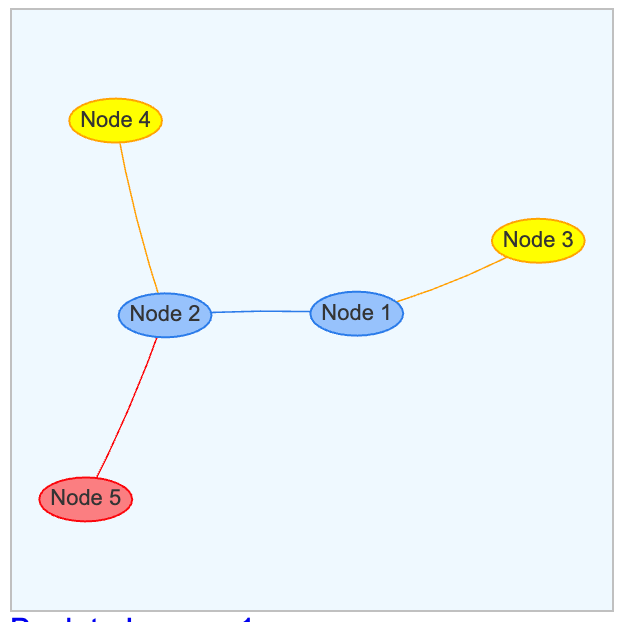

# Using Groups in Vis.js

## How To Add Groups to a Learning Graph Node

Each node in a learning graph can have a group attribute:

```json
{
    "nodes": [
        {"id": 1, "label": "Node 1", "group": 1},
        {"id": 2, "label": "Node 2", "group": 1},
        {"id": 3, "label": "Node 3", "group": 2},
        {"id": 4, "label": "Node 4", "group": 2},
        {"id": 5, "label": "Node 5", "group": 3}
    ],
    "edges": [
        {"from": 3, "to": 1},
        {"from": 2, "to": 1},
        {"from": 4, "to": 2},
        {"from": 5, "to": 2}
    ]
}
```


[Run Simple Groups Example](./01-simple-groups.html)

Note that in the JSON example file, the type of each group is an integer, but strings can also be used:

{
    "nodes": [
        {"id": 1, "label": "Node 1", "group": "Foundation"},
        {"id": 2, "label": "Node 2", "group": "Foundation"},
        {"id": 3, "label": "Node 3", "group": "Level 2"},
        {"id": 4, "label": "Node 4", "group": "Level 2"},
        {"id": 5, "label": "Node 5", "group": "Goal"}
    ],
    "edges": [
        {"from": 3, "to": 1},
        {"from": 2, "to": 1},
        {"from": 4, "to": 2},
        {"from": 5, "to": 2}
    ]
}
```

## Styling Graph Nodes

When options are loaded, we can add style elements to the groups object
within the options. 

```js
var options = {
  groups: {
    Foundation: {color:{background:'red'}, borderWidth:3}
  }
}
```

## References

[Vis.js Group Documentation](https://visjs.github.io/vis-network/docs/network/groups.html)

[Vis.js Groups Example](https://visjs.github.io/vis-network/examples/network/nodeStyles/groups.html)

[Vis.js Custom Groups Example](https://visjs.github.io/vis-network/examples/network/nodeStyles/customGroups.html)