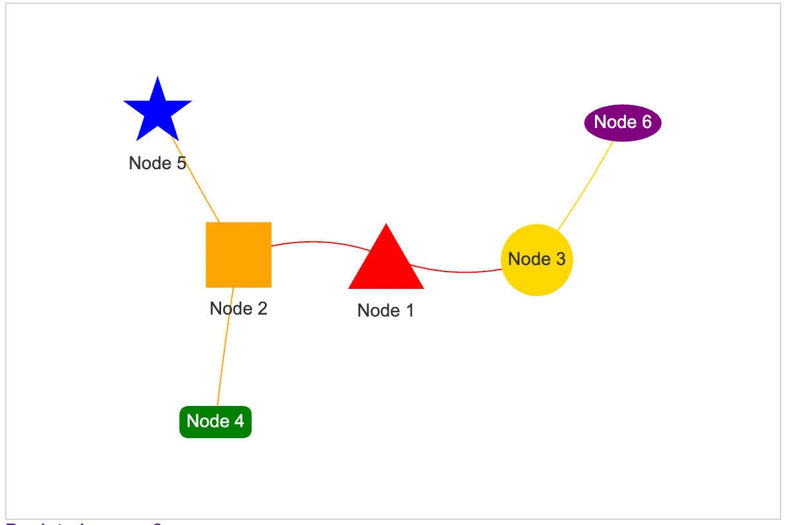

# Vis Tutorial Lesson 3: Node Properties



[Run Lab 3 HTML](lab-03.html)

In this lab we learn how to change the properties of each node including:

1. The shape
2. The background color
3. The size
4. The font color

## Prompt

```
Refactor the attached vis.js to add color and shape to each vertex.

Node 1: red triangle
Node 2: orange square
Node 3: gold circle
Node 4: green big box
Node 5: blue star
Node 6: purple ellipse
```

## ChatGPT o4 Response

To refactor the `lab-02` files to add color and shape to each vertex, we will modify the `lab-02.json` to include the color and shape properties for each node. Here's how we can adjust the structure:

### Updated `lab-03.json`:

```json
{
    "nodes": [
        {"id": 1, "label": "Node 1", "color": "red", "shape": "triangle"},
        {"id": 2, "label": "Node 2", "color": "orange", "shape": "square"},
        {"id": 3, "label": "Node 3", "color": "gold", "shape": "circle"},
        {"id": 4, "label": "Node 4", "color": "green", "shape": "box", "size": 50},
        {"id": 5, "label": "Node 5", "color": "blue", "shape": "star"},
        {"id": 6, "label": "Node 6", "color": "purple", "shape": "ellipse"}
    ],
    "edges": [
        {"from": 1, "to": 3},
        {"from": 1, "to": 2},
        {"from": 2, "to": 4},
        {"from": 2, "to": 5},
        {"from": 3, "to": 6}
    ]
}
```

### Updated `lab-03.js`:

You don't need to change much in the JavaScript file, but here it is for completeness.

```js
// Fetch data from the JSON file
fetch('lab-03.json')
    .then(response => response.json())
    .then(data => {
        // Parse the data from JSON
        const nodes = new vis.DataSet(data.nodes);
        const edges = new vis.DataSet(data.edges);

        // Create a network
        const container = document.getElementById('mynetwork');
        const networkData = {
            nodes: nodes,
            edges: edges
        };
        const options = {};

        // Initialize the network
        const network = new vis.Network(container, networkData, options);
    })
    .catch(error => console.error('Error loading the network data:', error));
```

### Changes explained:

-   Each node now has a `color` and `shape` property. These properties allow you to customize the appearance of each node.
-   For node 4, a larger size is specified with the `size` property to make it a "big box."
-   The edges are unchanged but include a new edge between nodes 3 and 6 to reflect the inclusion of Node 6.

When you run this, each node will now have the specified color and shape, creating a visually distinct network.

## Using White Text On Dark Colors

### Prompt

```
The black text is hard to read on the darker colors. How do I change the text to be white in the green and purple nodes?
```

### ChatGPT said:

ChatGPT

To change the text color for nodes with darker background colors like blue and purple, you can use the `font` property within each node's configuration to specify the text color. Here's how you can update your `lab-03.json` file to set the text color to white for the green and purple nodes:

### Updated `lab-02.json`:

```json
{
    "nodes": [
        {"id": 1, "label": "Node 1", "color": "red", "shape": "triangle"},
        {"id": 2, "label": "Node 2", "color": "orange", "shape": "square"},
        {"id": 3, "label": "Node 3", "color": "yellow", "shape": "circle"},
        {"id": 4, "label": "Node 4", "color": "green", "shape": "box", "size": 50, "font": {"color": "white"}},
        {"id": 5, "label": "Node 5", "color": "blue", "shape": "star"},
        {"id": 6, "label": "Node 6", "color": "purple", "shape": "ellipse", "font": {"color": "white"}}
    ],
    "edges": [
        {"from": 1, "to": 3},
        {"from": 1, "to": 2},
        {"from": 2, "to": 4},
        {"from": 2, "to": 5},
        {"from": 3, "to": 6}
    ]
}
```

### Explanation:

-   For `Node 5` (blue) and `Node 6` (purple), I added the `"font": {"color": "white"}` property, which changes the text color to white for better readability against the darker backgrounds.

Now, when you display the graph, the text on the blue and purple nodes will appear in white, making it much easier to read.

## More Things to Try

You can also change the border width:

1. borderWidth
2. color.border
3. opacity
4. icon
5. image

The size is used to determine the size of node shapes that do not have the label inside of them. These shapes are: image, circularImage, diamond, dot, star, triangle, triangleDown, hexagon, square and icon

## Custom Canvas Shapes

You can make the shape "custom" and then supply a Canvas drawing function:

[Canvas Drawing Function](https://developer.mozilla.org/en-US/docs/Web/API/Canvas_API/Tutorial/Drawing_shapes)

## References

[Vis.js Documentation on Node Properties](https://visjs.github.io/vis-network/docs/network/nodes.html)