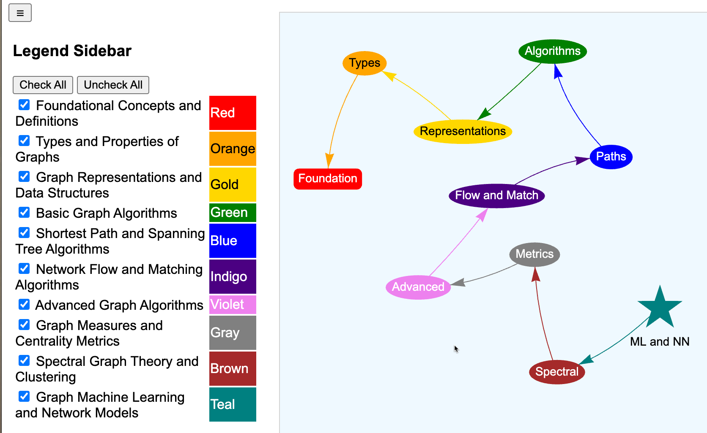
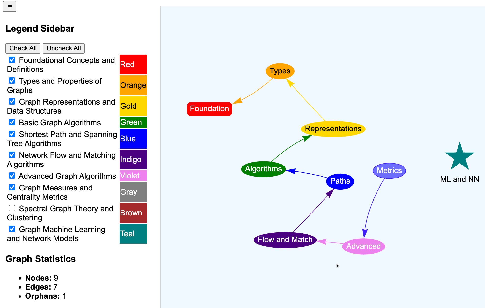

# Legend Checkboxes

We had a user that wanted to only display specific groups in a learning graph.
In order to do this, we need a way to add group-by-group selectors.
So we asked ChatGPT if we could add checkboxes to the legend.



[Run the Legend Checkboxes MicroSim](./legend-checkboxes.html){ .md-button .md-button--primary }

## Prompt

```linenums="0"
I have a vis.js program that has a legend for the node types.
I would like to conditionally include specific nodes that are
in groups in the network graphs. 
Using the following template, create a new version that puts
checkboxes in the legend in the sidebar.
The checkboxes will turn on and off the inclusion of each
group in the network.
```

## Response

To implement checkboxes in the legend sidebar to control the visibility of specific groups in the network, I’ll modify your template to add checkboxes next to each group. The checkboxes will toggle the visibility of nodes in that specific group. When a checkbox is unchecked, nodes in that group will be hidden from the network graph; when checked, they will be displayed.

### Explanation

#### Group and Checkbox Property Consistency

- **Updated Node Groups**: Each node's `group` property now matches the IDs of the checkboxes. For example, the node for "Foundation" has `group: 'Foundation'`.

```javascript
{
  id: 1, 
  label: 'Foundation', 
   shape: "box", 
   color: "red", 
   font: {color: "white"}, 
   group: 'Foundation'
}
```

- **Checkbox IDs and `toggleGroup` Function**: The `id` attributes of the checkboxes match the `group` names. The `toggleGroup` function now uses the `groupName` to reference both the checkbox and the node group.

```html
<input type="checkbox" id="groupFoundation" checked onchange="toggleGroup('Foundation')">
```

#### JavaScript Function to Toggle Group Visibility

```javascript
function toggleGroup(groupName) {
      const visible = document.getElementById(`group${groupName}`).checked;
      nodes.forEach(node => {
        if (node.group === groupName) {
          nodes.update({id: node.id, hidden: !visible});
        }
      });
    }
```

- **Consistent Colors**: The colors in the legend now match the colors assigned to the nodes. For example, "Flow and Match" uses `color: "indigo"` and the legend reflects this with `background-color: indigo`.

```html
<td style="background-color: indigo; color: white;">Indigo</td>
```

### Testing the Fix:

-   When you uncheck a checkbox in the legend, the corresponding nodes in the network graph should disappear.
-   When you check the checkbox again, the nodes reappear.

### Additional Notes:

-   **Edge Visibility**: If you need the edges connected to the hidden nodes to also be hidden, Vis.js handles this automatically when a connected node is hidden.

-   **Multiple Nodes per Group**: If you have more nodes in each group, this method will scale appropriately.

### Example Legend Checkbox Program

[Legend Checkboxes](./legend-checkboxes-v1.html)

## Adding "Check All" and "Uncheck All" Buttons

### Prompt

```linenums="0"
How can I add two buttons that will "Check All" and "Uncheck All"?
```

### Response

ChatGPT Thought for 17 seconds

Certainly! To add "Check All" and "Uncheck All" buttons that control all the group checkboxes and update the network graph accordingly, we'll:

1.  **Add two buttons** labeled "Check All" and "Uncheck All" above the legend table.
2.  **Implement two functions**, `checkAllGroups()` and `uncheckAllGroups()`, that will check or uncheck all the checkboxes and update the node visibility in the network graph.
3.  **Ensure that the network graph updates efficiently** when these buttons are clicked.

Here's the updated code with the new buttons and functions

### Explanation of Changes:

#### 1.  **Added "Check All" and "Uncheck All" Buttons:**

```html
<div>
    <button onclick="checkAllGroups()">Check All</button>
    <button onclick="uncheckAllGroups()">Uncheck All</button>
</div>
```
-   These buttons are placed above the legend table in the sidebar.
-   They call the functions `checkAllGroups()` and `uncheckAllGroups()` when clicked.

#### 2.  **Implemented `checkAllGroups()` Function:**

```javascript
function checkAllGroups() {
      const checkboxes = document.querySelectorAll('input[id^="group"]');
      checkboxes.forEach(checkbox => {
        if (!checkbox.checked) {
          checkbox.checked = true;
          // Update nodes in this group to be visible
          toggleGroup(checkbox.id.replace('group', ''));
        }
      });
    }
```
-   **Purpose:** Checks all the group checkboxes and makes all corresponding nodes visible.
-   **How it Works:**
    -   Selects all input elements with IDs starting with `"group"`.
    -   Loops through each checkbox:
        -   If it's not already checked, it sets `checkbox.checked = true`.
        -   Calls `toggleGroup()` with the group name to update node visibility.

#### 3.  **Implemented `uncheckAllGroups()` Function:**

```javascript
function uncheckAllGroups() {
      const checkboxes = document.querySelectorAll('input[id^="group"]');
      checkboxes.forEach(checkbox => {
        if (checkbox.checked) {
          checkbox.checked = false;
          // Update nodes in this group to be hidden
          toggleGroup(checkbox.id.replace('group', ''));
        }
      });
    }
```

  -   **Purpose:** Unchecks all the group checkboxes and hides all corresponding nodes.
  -   **How it Works:**
      -   Selects all input elements with IDs starting with `"group"`.
      -   Loops through each checkbox:
          -   If it's checked, it sets `checkbox.checked = false`.
            -   Calls `toggleGroup()` with the group name to update node visibility.

#### 4.  **Optimizing Node Updates:**

-   By only calling `toggleGroup()` when a checkbox state changes (from unchecked to checked or vice versa), we avoid unnecessary updates.
-   The `toggleGroup()` function handles updating the node visibility based on the current state of the checkbox.

#### 5.  **Ensuring Consistent Group Names:**

-   The `replace('group', '')` method extracts the group name from the checkbox ID (e.g., from `"groupFoundation"` to `"Foundation"`).
-   This ensures that `toggleGroup()` receives the correct group name to update node visibility.

### How It Works:

-   **"Check All" Button:**

    -   When clicked, all checkboxes become checked.
    -   For each checkbox that was previously unchecked, `toggleGroup()` is called to set the corresponding nodes as visible.
    -   The network graph updates to show all nodes.
-   **"Uncheck All" Button:**

    -   When clicked, all checkboxes become unchecked.
    -   For each checkbox that was previously checked, `toggleGroup()` is called to hide the corresponding nodes.
    -   The network graph updates to hide all nodes.
-   **Individual Checkboxes:**

    -   The existing functionality for individual checkboxes remains unchanged.
    -   Checking or unchecking a group checkbox will show or hide nodes in that group.

### Additional Notes:

-   **Edge Visibility:**

    -   Vis.js automatically handles edge visibility. If both connected nodes are hidden, the edge is also hidden.
    -   If one node is visible and the other is hidden, the edge will still be displayed, connected to the visible node.
-   **Scalability:**

    -   This approach works efficiently even if more groups or nodes are added.
    -   The functions dynamically select checkboxes and nodes based on IDs and group names.
-   **Accessibility:**

    -   The buttons and checkboxes are standard HTML elements, ensuring compatibility with assistive technologies.

### Testing the Implementation:

1.  **Initial State:**

    -   All checkboxes are checked.
    -   All nodes are visible in the network graph.
2.  **Uncheck All:**

    -   Click the "Uncheck All" button.
    -   All checkboxes become unchecked.
    -   All nodes are hidden in the network graph.
3.  **Check All:**

  -   Click the "Check All" button.
  -   All checkboxes become checked.
  -   All nodes reappear in the network graph.

4.  **Combination:**

-   Uncheck individual checkboxes to hide specific groups.
-   Use "Check All" to restore visibility to all groups.

### Summary of Check All and Uncheck All

By adding the "Check All" and "Uncheck All" buttons and implementing the corresponding functions, users can easily control the visibility of all node groups in the network graph with a single click. This enhancement improves the usability of the application, especially when dealing with a large number of groups.

[Example of Check All](legend-checkboxes-v2.html)

## Adding Network Statistics



When we disable some nodes with the checkboxes, we often need to
know that some nodes are now disconnected from the network.
We can see the number of orphaned nodes by running
a simple query on the graph.  Here is how it works.

## Graph Statistics Prompt

### Sample Prompt

```linenums="0"
How would I modify the code to display the network statistics
in the sidebar such as number of nodes, number of edges and
number of orphaned nodes? 
Use HTML in the sidebar under "Graph Statistics".
```

### Sample Response

ChatGPT o1-preview Thought for 24 seconds

Certainly! To display dynamic network statistics---such as the number of nodes, number of edges, and number of orphaned nodes---in the sidebar under "Graph Statistics", we'll need to:

1.  **Add placeholders in the HTML** for the statistics.
2.  **Write a function `updateStatistics()`** that calculates these statistics based on the current state of the network.
3.  **Call `updateStatistics()`** whenever the network changes (e.g., when nodes are shown or hidden via the checkboxes).

Below is the updated code with the necessary modifications:

```html
<!DOCTYPE html>
<html>
<head>
  <title>Demo of Toggle Sidebar Legend</title>
  <script type="text/javascript" src="https://unpkg.com/vis-network/standalone/umd/vis-network.min.js"></script>
  <style>
    body {
      font-family: Arial, Helvetica, sans-serif;
      display: flex;
    }

    #sidebar {
      width: auto;
      max-width: 300px;
      padding: 5px;
      margin-right: 10px;
      box-sizing: border-box;
    }

    #main {
      flex: 1;
      padding: 10px;
    }

    #mynetwork {
      width: 100%;
      height: 700px;
      background-color: aliceblue;
      border: 1px solid lightgray;
    }
  </style>
</head>

<body>
  <div id="sidebar-container">
    <button id="toggle-button" onclick="toggleSidebar()">&#9776;</button>

    <div id="sidebar">
      <h3>Legend Sidebar</h3>
      
      <div>
        <button onclick="checkAllGroups()">Check All</button>
        <button onclick="uncheckAllGroups()">Uncheck All</button>
      </div>
      <table>
        <tr>
          <td><input type="checkbox" id="groupFoundation" checked onchange="toggleGroup('Foundation')"> Foundational Concepts and Definitions</td>
          <td style="background-color: red; color: white;">Red</td>
        </tr>
        <tr>
          <td><input type="checkbox" id="groupTypes" checked onchange="toggleGroup('Types')"> Types and Properties of Graphs</td>
          <td style="background-color: orange;">Orange</td>
        </tr>
        <tr>
          <td><input type="checkbox" id="groupRepresentations" checked onchange="toggleGroup('Representations')"> Graph Representations and Data Structures</td>
          <td style="background-color: gold;">Gold</td>
        </tr>
        <tr>
          <td><input type="checkbox" id="groupAlgorithms" checked onchange="toggleGroup('Algorithms')"> Basic Graph Algorithms</td>
          <td style="background-color: green; color: white;">Green</td>
        </tr>
        <tr>
          <td><input type="checkbox" id="groupPaths" checked onchange="toggleGroup('Paths')"> Shortest Path and Spanning Tree Algorithms</td>
          <td style="background-color: blue; color: white;">Blue</td>
        </tr>
        <tr>
          <td><input type="checkbox" id="groupFlow" checked onchange="toggleGroup('Flow')"> Network Flow and Matching Algorithms</td>
          <td style="background-color: indigo; color: white;">Indigo</td>
        </tr>
        <tr>
          <td><input type="checkbox" id="groupAdvanced" checked onchange="toggleGroup('Advanced')"> Advanced Graph Algorithms</td>
          <td style="background-color: violet; color: white;">Violet</td>
        </tr>
        <tr>
          <td><input type="checkbox" id="groupMetrics" checked onchange="toggleGroup('Metrics')"> Graph Measures and Centrality Metrics</td>
          <td style="background-color: gray; color: white;">Gray</td>
        </tr>
        <tr>
          <td><input type="checkbox" id="groupSpectral" checked onchange="toggleGroup('Spectral')"> Spectral Graph Theory and Clustering</td>
          <td style="background-color: brown; color: white;">Brown</td>
        </tr>
        <tr>
          <td><input type="checkbox" id="groupML" checked onchange="toggleGroup('ML')"> Graph Machine Learning and Network Models</td>
          <td style="background-color: teal; color: white;">Teal</td>
        </tr>
      </table>
      <h3>Graph Statistics</h3>
      
      <ul>
        <li><b>Nodes:</b> <span id="nodeCount">0</span></li>
        <li><b>Edges:</b> <span id="edgeCount">0</span></li>
        <li><b>Orphans:</b> <span id="orphanCount">0</span></li>
      </ul>
    </div>
  </div>
  <div id="main">
    <div id="mynetwork"></div>
  </div>

  <script>
    function toggleSidebar() {
      const sidebar = document.getElementById("sidebar");
      const mainContent = document.getElementById("main");
      const toggleButton = document.getElementById("toggle-button");

      if (sidebar.style.display === "none") {
        sidebar.style.display = "block";
        toggleButton.innerHTML = "&#9776;";
        mainContent.style.marginLeft = "auto";
      } else {
        sidebar.style.display = "none";
        toggleButton.innerHTML = "&#8594;";
        mainContent.style.marginLeft = "0";
      }
    }

    // Create an array with nodes
    var nodes = new vis.DataSet([
      {id: 1, label: 'Foundation', shape: "box", color: "red", font: {color: "white"}, group: 'Foundation'},
      {id: 2, label: 'Types', color: "orange", font: {color: "black"}, group: 'Types'},
      {id: 3, label: 'Representations', color: "gold", font: {color: "black"}, group: 'Representations'},
      {id: 4, label: 'Algorithms', color: "green", font: {color: "white"}, group: 'Algorithms'},
      {id: 5, label: 'Paths', color: "blue", font: {color: "white"}, group: 'Paths'},
      {id: 6, label: 'Flow and Match', color: "indigo", font: {color: "white"}, group: 'Flow'},
      {id: 7, label: 'Advanced', color: "violet", font: {color: "white"}, group: 'Advanced'},
      {id: 8, label: 'Metrics', color: "gray", font: {color: "white"}, group: 'Metrics'},
      {id: 9, label: 'Spectral', color: "brown", font: {color: "white"}, group: 'Spectral'},
      {id: 10, label: 'ML and NN', shape: "star", color: "teal", font: {color: "black"}, group: 'ML'},
    ]);

    // Create an array with edges
    var edges = new vis.DataSet([
      {from: 2, to: 1},
      {from: 3, to: 2},
      {from: 4, to: 3},
      {from: 5, to: 4},
      {from: 6, to: 5},
      {from: 7, to: 6},
      {from: 8, to: 7},
      {from: 9, to: 8},
      {from: 10, to: 9}
    ]);

    // Create a network
    var container = document.getElementById('mynetwork');

    // Provide the data in the vis format
    var data = {
      nodes: nodes,
      edges: edges
    };
    var options = {
      edges: {
        arrows: {
          to: { enabled: true, type: 'arrow', color: 'black', scaleFactor: 1 }
        },
        smooth: { type: 'continuous' }
      },
      layout: {
        hierarchical: { direction: "LR" }
      }
    };
    var network = new vis.Network(container, data, options);

    // Function to update statistics
    function updateStatistics() {
      // Get all nodes and edges
      var allNodes = nodes.get();
      var allEdges = edges.get();

      // Filter visible nodes
      var visibleNodes = allNodes.filter(node => !node.hidden);

      // Filter visible edges (both connected nodes must be visible)
      var visibleEdges = allEdges.filter(edge => {
        var fromNode = nodes.get(edge.from);
        var toNode = nodes.get(edge.to);
        return (!fromNode.hidden && !toNode.hidden);
      });

      // Calculate number of visible nodes and edges
      var nodeCount = visibleNodes.length;
      var edgeCount = visibleEdges.length;

      // Find orphan nodes (nodes with no visible edges)
      var connectedNodeIds = new Set();
      visibleEdges.forEach(edge => {
        connectedNodeIds.add(edge.from);
        connectedNodeIds.add(edge.to);
      });
      var orphanNodes = visibleNodes.filter(node => !connectedNodeIds.has(node.id));
      var orphanCount = orphanNodes.length;

      // Update the HTML elements with the statistics
      document.getElementById('nodeCount').textContent = nodeCount;
      document.getElementById('edgeCount').textContent = edgeCount;
      document.getElementById('orphanCount').textContent = orphanCount;
    }

    // Call updateStatistics after the network is initialized
    updateStatistics();

    // Function to toggle groups
    function toggleGroup(groupName) {
      const visible = document.getElementById(`group${groupName}`).checked;
      nodes.forEach(node => {
        if (node.group === groupName) {
          nodes.update({id: node.id, hidden: !visible});
        }
      });
      updateStatistics(); // Update statistics after toggling a group
    }

    // Function to check all groups
    function checkAllGroups() {
      const checkboxes = document.querySelectorAll('input[id^="group"]');
      checkboxes.forEach(checkbox => {
        if (!checkbox.checked) {
          checkbox.checked = true;
          // Update nodes in this group to be visible
          toggleGroup(checkbox.id.replace('group', ''));
        }
      });
      // updateStatistics(); // Already called within toggleGroup
    }

    // Function to uncheck all groups
    function uncheckAllGroups() {
      const checkboxes = document.querySelectorAll('input[id^="group"]');
      checkboxes.forEach(checkbox => {
        if (checkbox.checked) {
          checkbox.checked = false;
          // Update nodes in this group to be hidden
          toggleGroup(checkbox.id.replace('group', ''));
        }
      });
      // updateStatistics(); // Already called within toggleGroup
    }
  </script>
</body>
</html>
```

### Explanation of Modifications:

#### Step 1.  **Added Placeholders in the HTML for Statistics:**

```html
<h3>Graph Statistics</h3>
  <ul>
    <li><b>Nodes:</b> <span id="nodeCount">0</span></li>
    <li><b>Edges:</b> <span id="edgeCount">0</span></li>
    <li><b>Orphans:</b> <span id="orphanCount">0</span></li>
  </ul>
```
  -   Replaced the hardcoded numbers with `<span>` elements having IDs (`nodeCount`, `edgeCount`, `orphanCount`).
  -   These elements will be updated dynamically via JavaScript.
#### Step 2.  **Created `updateStatistics()` Function:**

  ```javascript
  function updateStatistics() {
      // Get all nodes and edges
      var allNodes = nodes.get();
      var allEdges = edges.get();

      // Filter visible nodes
      var visibleNodes = allNodes.filter(node => !node.hidden);

      // Filter visible edges (both connected nodes must be visible)
      var visibleEdges = allEdges.filter(edge => {
        var fromNode = nodes.get(edge.from);
        var toNode = nodes.get(edge.to);
        return (!fromNode.hidden && !toNode.hidden);
      });

      // Calculate number of visible nodes and edges
      var nodeCount = visibleNodes.length;
      var edgeCount = visibleEdges.length;

      // Find orphan nodes (nodes with no visible edges)
      var connectedNodeIds = new Set();
      visibleEdges.forEach(edge => {
        connectedNodeIds.add(edge.from);
        connectedNodeIds.add(edge.to);
      });
      var orphanNodes = visibleNodes.filter(node => !connectedNodeIds.has(node.id));
      var orphanCount = orphanNodes.length;

      // Update the HTML elements with the statistics
      document.getElementById('nodeCount').textContent = nodeCount;
      document.getElementById('edgeCount').textContent = edgeCount;
      document.getElementById('orphanCount').textContent = orphanCount;
    }
```

-   **Purpose:** Calculates the current number of visible nodes, visible edges, and orphan nodes, and updates the HTML elements accordingly.

-   **Steps in the Function:**
  -   **Get All Nodes and Edges:** Retrieve all nodes and edges from the DataSets.
  -   **Filter Visible Nodes:** Use `filter` to get nodes that are not hidden.
  -   **Filter Visible Edges:** Only include edges where both the `from` and `to` nodes are visible.
  -   **Calculate Counts:** Count the number of visible nodes and edges.
  -   **Identify Orphan Nodes:**
      -   Create a `Set` of node IDs that are connected via visible edges.
      -   An orphan node is one that is visible but not included in the `connectedNodeIds` set.
  -   **Update HTML Elements:** Set the `textContent` of the span elements to display the calculated counts.

#### Step 3.  **Calling `updateStatistics()` Appropriately:**

-   **After Network Initialization:**

```javascript
// Call updateStatistics after the network is initialized
        updateStatistics();
```
-   Ensures that the statistics are accurate when the page first loads.
-   **Within `toggleGroup()` Function:**

```javascript
function toggleGroup(groupName) {
// ... existing code ...
  updateStatistics(); // Update statistics after toggling a group
}`
```

-   Updates statistics whenever a group is toggled (shown or hidden).
-   **No Need to Call `updateStatistics()` in `checkAllGroups()` and `uncheckAllGroups()`:**
-   Since `toggleGroup()` is called for each group within these functions and `updateStatistics()` is called within `toggleGroup()`, it's unnecessary to call it again.
-   This avoids redundant calculations and ensures efficiency.

### How It Works:

-   **Initial Load:**
  -  The statistics display the total number of nodes and edges in the network.
  -   Orphan nodes are calculated based on the current visibility of nodes and edges.
-   **When Nodes Are Hidden/Shown:**
  -   Toggling checkboxes hides or shows nodes.
  -   Edges connected to hidden nodes are also hidden automatically by Vis.js.
  -   The `updateStatistics()` function recalculates the counts and updates the sidebar.
-   **Orphan Nodes:**
  -   An orphan node is a visible node with no visible edges connected to it.
  -   As nodes or edges are hidden, the number of orphan nodes may increase.

#### Testing the Implementation:

1.  **Check All Groups:**

-   Click "Check All" to ensure all nodes and edges are visible.
-   The statistics should display the total number of nodes and edges.
-   Orphan count should be `0` if all nodes are connected.

2.  **Uncheck All Groups:**

-   Click "Uncheck All" to hide all nodes.
-   Statistics should show `0` nodes, `0` edges, and `0` orphans.

3.  **Toggle Individual Groups:**

-   Uncheck individual groups to hide specific nodes.
-   Statistics should update to reflect the current counts.
-   Observe how the number of orphans changes as nodes become disconnected.

### Additional Notes:

-  **Edge Visibility:**
  -   Vis.js hides edges automatically when connected nodes are hidden.
  -   Edges are only considered visible if both connected nodes are visible.

-   **Scalability:**
  -   The `updateStatistics()` function works dynamically with any number of nodes and edges.
  -   If you add more nodes or edges, the statistics will adjust accordingly.
  
-   **Performance:**
  -   The use of `Set` for `connectedNodeIds` improves performance when checking for orphan nodes.
  -   Filtering and mapping functions are efficient for datasets of moderate size.

### Summary of Dynamic Networks Statistics

By adding dynamic network statistics to the sidebar, users can gain insights into the structure and connectivity of the network at any given time. The statistics update automatically in response to user interactions, enhancing the interactivity and usefulness of the visualization.
