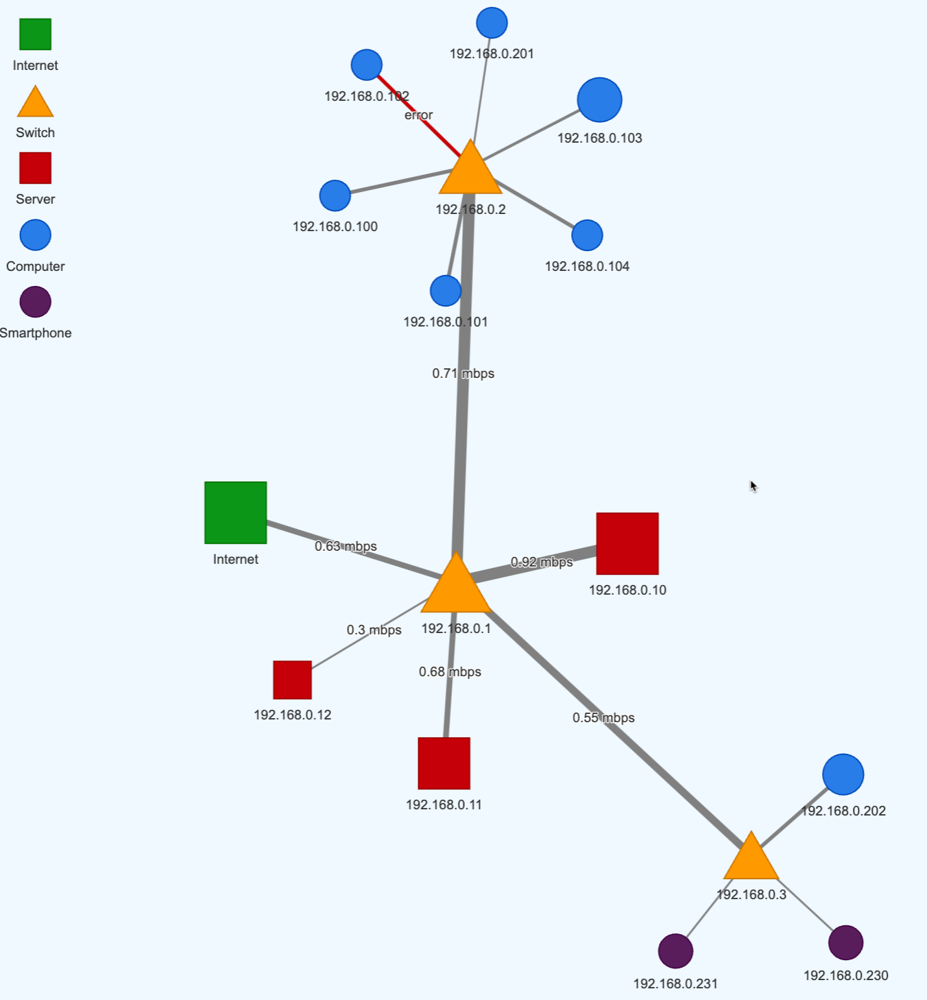
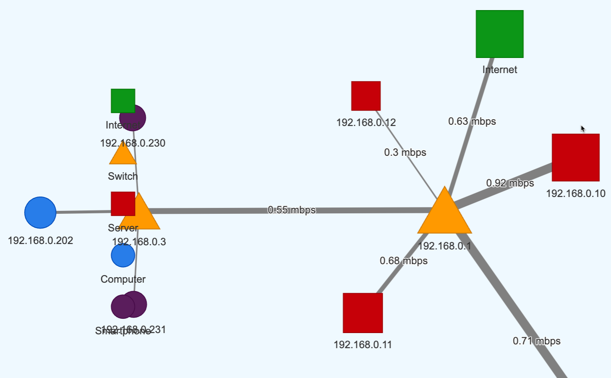

# Learning Graph Legends

A legend is a key that shows you what different shapes, icons, images and colors imply
in your learning graphs.  We will demo two ways to place a legend on your learning graph
and each method has tradeoffs.

[Node Legend](node-legend.html) - which uses nodes in the upper left area to
show the legend.  This legend tends to move around based on the scale of the
graph layout.

[HTML Table Legend](html-legend.html) - which uses a HTML table in a
CSS flexbox to display the legend.  The HTML table is usually placed
in a border region such as a left-sidebar.  This allows you to collapse
the sidebar with a toggle button (hamburger icon).

## Node Legend

The node legend has the advantage that it can use exactly the same colors, shapes, icons
and images as the nodes in the actual graph.

Here is a good example of how this might look:


Unfortunately, this legend can easily overlap with the actual graph network.

Here is a bad example where the actual nodes overlap the legend.


Sample of how node legends are use is at [node-legend.js](./html-legend.html) which
was originally taken from the [vis.js node legend example](https://visjs.github.io/vis-network/examples/network/exampleApplications/nodeLegend.html).

## HTML Table Legend

HTML tables usually are located in a fixed position of the edge of a graph viewer.
In the example above, we use a left-sidebar.
They have the benefit of having a regular structure that is easy to align.
They can also be configured to appear and disappear if the screen region
is needed for viewing the full graph.

## Felxbox Layout

The flexbox layout strategy allows us to just put in an HTML table with
an max value.  All the other region dimensions are calculated automatically with CSS.

### Explanation:

-   `display: flex` on the `body` element allows `#sidebar` and `#main` to sit side by side.
-   `#sidebar` automatically resizes based on its content, constrained by `max-width`.
-   `#main` with `flex: 1` takes up the remaining available space.

This approach avoids conflicts and should handle dynamic sizing for the sidebar smoothly.
Here’s an and example of the CSS using flexbox for layout control:

```html
<body>
    <div id="sidebar">
        <h3>Legend Sidebar</h3>
        <button id="toggle-button" onclick="toggleSidebar()">&#9776;</button>
        <table>
          <!--  table data here -->
        </table>
    </div>
    <div id="main">
        <div id="mynetwork"></div>
    </div>
</body>
```

```css
body {
    font-family: Arial, Helvetica, sans-serif;
    display: flex;
}

#sidebar {
    width: auto; /* Automatically adjust width based on content in the table */
    max-width: 300px; /* Set a maximum width to avoid excessive size */
    padding: 5px; /* around the sidebar */
    margin-right: 10px; /* Space between sidebar and main content */
    box-sizing: border-box;
}

#main {
    flex: 1; /* Takes up remaining space to the right */
    padding: 10px;
}

#mynetwork {
    width: 100%;
    height: 700px;
    background-color: aliceblue;
    border: 1px solid lightgray;
}
```

## Toggle Sidebar

[Lab 6: Toggle Sidebar](./toggle-legend.html)

## Node Legends

[](https://visjs.github.io/vis-network/examples/network/exampleApplications/nodeLegend.html)

https://jsfiddle.net/adgd87/szt7h6kv/19/